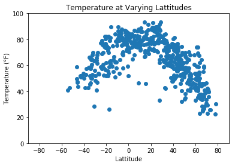
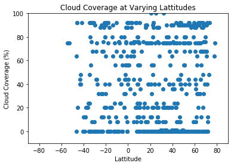
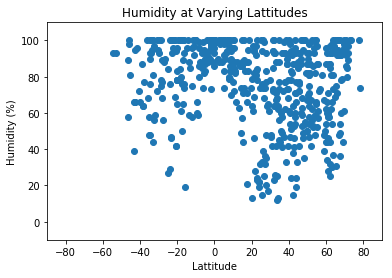
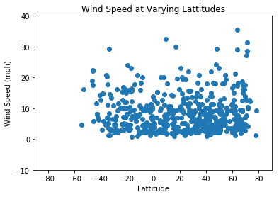

```python
import requests
from config import api_key
from citipy import citipy
import random
import pandas as pd
from urllib.error import HTTPError
import matplotlib.pyplot as plt
```


```python
random_lats = []
random_longs = []
cities = []

for i in range(0,1500):
    random_lats.append(random.uniform(-90, 90))
    random_longs.append(random.uniform(-180, 180))

for i in range(len(random_lats)):
    cities.append(citipy.nearest_city(random_lats[i], random_longs[i]))
```


```python
city=[]
city_names = []
city_names_url = []

for i in range(len(cities)):
    city.append(cities[i].city_name)
    
for x in city:
        if x not in city_names:
            city_names.append(x)

for city in range(len(city_names)):
    city_names_url.append(city_names[city].replace(" ", "+"))
```


```python
weather_data = []
url = "http://api.openweathermap.org/data/2.5/weather?"
units = "imperial"
request_count = 0

for city in city_names_url:
    request_count = request_count + 1
    print(f"Processing request #{request_count}: {city}")
    full_url = f"{url}appid={api_key}&units={units}&q={city}"
    print(full_url)
    weather_data.append(requests.get(full_url).json())
```

    Processing request #1: ushuaia
    http://api.openweathermap.org/data/2.5/weather?appid=484687ed27ded134ccacfcfb8cb36de0&units=imperial&q=ushuaia
    Processing request #2: attawapiskat
    http://api.openweathermap.org/data/2.5/weather?appid=484687ed27ded134ccacfcfb8cb36de0&units=imperial&q=attawapiskat
    Processing request #3: san+quintin
    http://api.openweathermap.org/data/2.5/weather?appid=484687ed27ded134ccacfcfb8cb36de0&units=imperial&q=san+quintin
    Processing request #4: upernavik
    http://api.openweathermap.org/data/2.5/weather?appid=484687ed27ded134ccacfcfb8cb36de0&units=imperial&q=upernavik
    Processing request #5: tulsipur
    http://api.openweathermap.org/data/2.5/weather?appid=484687ed27ded134ccacfcfb8cb36de0&units=imperial&q=tulsipur
    Processing request #6: kapaa
    http://api.openweathermap.org/data/2.5/weather?appid=484687ed27ded134ccacfcfb8cb36de0&units=imperial&q=kapaa
    Processing request #7: chuy
    http://api.openweathermap.org/data/2.5/weather?appid=484687ed27ded134ccacfcfb8cb36de0&units=imperial&q=chuy
    Processing request #8: barentsburg
    http://api.openweathermap.org/data/2.5/weather?appid=484687ed27ded134ccacfcfb8cb36de0&units=imperial&q=barentsburg
    Processing request #9: new+norfolk
    http://api.openweathermap.org/data/2.5/weather?appid=484687ed27ded134ccacfcfb8cb36de0&units=imperial&q=new+norfolk
    Processing request #10: shimoda
    http://api.openweathermap.org/data/2.5/weather?appid=484687ed27ded134ccacfcfb8cb36de0&units=imperial&q=shimoda
    Processing request #11: aykhal
    http://api.openweathermap.org/data/2.5/weather?appid=484687ed27ded134ccacfcfb8cb36de0&units=imperial&q=aykhal
    Processing request #12: umzimvubu
    http://api.openweathermap.org/data/2.5/weather?appid=484687ed27ded134ccacfcfb8cb36de0&units=imperial&q=umzimvubu
    Processing request #13: slave+lake
    http://api.openweathermap.org/data/2.5/weather?appid=484687ed27ded134ccacfcfb8cb36de0&units=imperial&q=slave+lake
    Processing request #14: viedma
    http://api.openweathermap.org/data/2.5/weather?appid=484687ed27ded134ccacfcfb8cb36de0&units=imperial&q=viedma
    Processing request #15: jamestown
    http://api.openweathermap.org/data/2.5/weather?appid=484687ed27ded134ccacfcfb8cb36de0&units=imperial&q=jamestown
    Processing request #16: vila+franca+do+campo
    http://api.openweathermap.org/data/2.5/weather?appid=484687ed27ded134ccacfcfb8cb36de0&units=imperial&q=vila+franca+do+campo
    Processing request #17: avarua
    http://api.openweathermap.org/data/2.5/weather?appid=484687ed27ded134ccacfcfb8cb36de0&units=imperial&q=avarua
    Processing request #18: masuda
    http://api.openweathermap.org/data/2.5/weather?appid=484687ed27ded134ccacfcfb8cb36de0&units=imperial&q=masuda
    Processing request #19: hermanus
    http://api.openweathermap.org/data/2.5/weather?appid=484687ed27ded134ccacfcfb8cb36de0&units=imperial&q=hermanus
    Processing request #20: bosaso
    http://api.openweathermap.org/data/2.5/weather?appid=484687ed27ded134ccacfcfb8cb36de0&units=imperial&q=bosaso
    Processing request #21: punta+arenas
    http://api.openweathermap.org/data/2.5/weather?appid=484687ed27ded134ccacfcfb8cb36de0&units=imperial&q=punta+arenas
    Processing request #22: port+elizabeth
    http://api.openweathermap.org/data/2.5/weather?appid=484687ed27ded134ccacfcfb8cb36de0&units=imperial&q=port+elizabeth
    Processing request #23: korla
    http://api.openweathermap.org/data/2.5/weather?appid=484687ed27ded134ccacfcfb8cb36de0&units=imperial&q=korla
    Processing request #24: hithadhoo
    http://api.openweathermap.org/data/2.5/weather?appid=484687ed27ded134ccacfcfb8cb36de0&units=imperial&q=hithadhoo
    Processing request #25: miri
    http://api.openweathermap.org/data/2.5/weather?appid=484687ed27ded134ccacfcfb8cb36de0&units=imperial&q=miri
    Processing request #26: lebu
    http://api.openweathermap.org/data/2.5/weather?appid=484687ed27ded134ccacfcfb8cb36de0&units=imperial&q=lebu
    Processing request #27: castro
    http://api.openweathermap.org/data/2.5/weather?appid=484687ed27ded134ccacfcfb8cb36de0&units=imperial&q=castro
    Processing request #28: pisco
    http://api.openweathermap.org/data/2.5/weather?appid=484687ed27ded134ccacfcfb8cb36de0&units=imperial&q=pisco
    Processing request #29: rikitea
    http://api.openweathermap.org/data/2.5/weather?appid=484687ed27ded134ccacfcfb8cb36de0&units=imperial&q=rikitea
    Processing request #30: gravdal
    http://api.openweathermap.org/data/2.5/weather?appid=484687ed27ded134ccacfcfb8cb36de0&units=imperial&q=gravdal
    Processing request #31: asau
    http://api.openweathermap.org/data/2.5/weather?appid=484687ed27ded134ccacfcfb8cb36de0&units=imperial&q=asau
    Processing request #32: yellowknife
    http://api.openweathermap.org/data/2.5/weather?appid=484687ed27ded134ccacfcfb8cb36de0&units=imperial&q=yellowknife
    Processing request #33: taolanaro
    http://api.openweathermap.org/data/2.5/weather?appid=484687ed27ded134ccacfcfb8cb36de0&units=imperial&q=taolanaro
    Processing request #34: carnarvon
    http://api.openweathermap.org/data/2.5/weather?appid=484687ed27ded134ccacfcfb8cb36de0&units=imperial&q=carnarvon
    Processing request #35: cape+town
    http://api.openweathermap.org/data/2.5/weather?appid=484687ed27ded134ccacfcfb8cb36de0&units=imperial&q=cape+town
    Processing request #36: narsaq
    http://api.openweathermap.org/data/2.5/weather?appid=484687ed27ded134ccacfcfb8cb36de0&units=imperial&q=narsaq
    Processing request #37: tuktoyaktuk
    http://api.openweathermap.org/data/2.5/weather?appid=484687ed27ded134ccacfcfb8cb36de0&units=imperial&q=tuktoyaktuk
    Processing request #38: thompson
    http://api.openweathermap.org/data/2.5/weather?appid=484687ed27ded134ccacfcfb8cb36de0&units=imperial&q=thompson
    Processing request #39: kutum
    http://api.openweathermap.org/data/2.5/weather?appid=484687ed27ded134ccacfcfb8cb36de0&units=imperial&q=kutum
    Processing request #40: tasiilaq
    http://api.openweathermap.org/data/2.5/weather?appid=484687ed27ded134ccacfcfb8cb36de0&units=imperial&q=tasiilaq
    Processing request #41: hasaki
    http://api.openweathermap.org/data/2.5/weather?appid=484687ed27ded134ccacfcfb8cb36de0&units=imperial&q=hasaki
    Processing request #42: portland
    http://api.openweathermap.org/data/2.5/weather?appid=484687ed27ded134ccacfcfb8cb36de0&units=imperial&q=portland
    Processing request #43: georgetown
    http://api.openweathermap.org/data/2.5/weather?appid=484687ed27ded134ccacfcfb8cb36de0&units=imperial&q=georgetown
    Processing request #44: port+moresby
    http://api.openweathermap.org/data/2.5/weather?appid=484687ed27ded134ccacfcfb8cb36de0&units=imperial&q=port+moresby
    Processing request #45: mange
    http://api.openweathermap.org/data/2.5/weather?appid=484687ed27ded134ccacfcfb8cb36de0&units=imperial&q=mange
    Processing request #46: tamiahua
    http://api.openweathermap.org/data/2.5/weather?appid=484687ed27ded134ccacfcfb8cb36de0&units=imperial&q=tamiahua
    Processing request #47: vaini
    http://api.openweathermap.org/data/2.5/weather?appid=484687ed27ded134ccacfcfb8cb36de0&units=imperial&q=vaini
    Processing request #48: iskateley
    http://api.openweathermap.org/data/2.5/weather?appid=484687ed27ded134ccacfcfb8cb36de0&units=imperial&q=iskateley
    Processing request #49: batagay
    http://api.openweathermap.org/data/2.5/weather?appid=484687ed27ded134ccacfcfb8cb36de0&units=imperial&q=batagay
    Processing request #50: hobart
    http://api.openweathermap.org/data/2.5/weather?appid=484687ed27ded134ccacfcfb8cb36de0&units=imperial&q=hobart
    Processing request #51: mataura
    http://api.openweathermap.org/data/2.5/weather?appid=484687ed27ded134ccacfcfb8cb36de0&units=imperial&q=mataura
    Processing request #52: tuatapere
    http://api.openweathermap.org/data/2.5/weather?appid=484687ed27ded134ccacfcfb8cb36de0&units=imperial&q=tuatapere
    Processing request #53: meteti
    http://api.openweathermap.org/data/2.5/weather?appid=484687ed27ded134ccacfcfb8cb36de0&units=imperial&q=meteti
    Processing request #54: nelson+bay
    http://api.openweathermap.org/data/2.5/weather?appid=484687ed27ded134ccacfcfb8cb36de0&units=imperial&q=nelson+bay
    Processing request #55: bereznyky
    http://api.openweathermap.org/data/2.5/weather?appid=484687ed27ded134ccacfcfb8cb36de0&units=imperial&q=bereznyky
    Processing request #56: nikolskoye
    http://api.openweathermap.org/data/2.5/weather?appid=484687ed27ded134ccacfcfb8cb36de0&units=imperial&q=nikolskoye
    Processing request #57: amderma
    http://api.openweathermap.org/data/2.5/weather?appid=484687ed27ded134ccacfcfb8cb36de0&units=imperial&q=amderma
    Processing request #58: sangar
    http://api.openweathermap.org/data/2.5/weather?appid=484687ed27ded134ccacfcfb8cb36de0&units=imperial&q=sangar
    Processing request #59: bluff
    http://api.openweathermap.org/data/2.5/weather?appid=484687ed27ded134ccacfcfb8cb36de0&units=imperial&q=bluff
    Processing request #60: ketchikan
    http://api.openweathermap.org/data/2.5/weather?appid=484687ed27ded134ccacfcfb8cb36de0&units=imperial&q=ketchikan
    Processing request #61: paamiut
    http://api.openweathermap.org/data/2.5/weather?appid=484687ed27ded134ccacfcfb8cb36de0&units=imperial&q=paamiut
    Processing request #62: padang
    http://api.openweathermap.org/data/2.5/weather?appid=484687ed27ded134ccacfcfb8cb36de0&units=imperial&q=padang
    Processing request #63: puerto+ayora
    http://api.openweathermap.org/data/2.5/weather?appid=484687ed27ded134ccacfcfb8cb36de0&units=imperial&q=puerto+ayora
    Processing request #64: eucaliptus
    http://api.openweathermap.org/data/2.5/weather?appid=484687ed27ded134ccacfcfb8cb36de0&units=imperial&q=eucaliptus
    Processing request #65: luba
    http://api.openweathermap.org/data/2.5/weather?appid=484687ed27ded134ccacfcfb8cb36de0&units=imperial&q=luba
    Processing request #66: port+alfred
    http://api.openweathermap.org/data/2.5/weather?appid=484687ed27ded134ccacfcfb8cb36de0&units=imperial&q=port+alfred
    Processing request #67: chagda
    http://api.openweathermap.org/data/2.5/weather?appid=484687ed27ded134ccacfcfb8cb36de0&units=imperial&q=chagda
    Processing request #68: birao
    http://api.openweathermap.org/data/2.5/weather?appid=484687ed27ded134ccacfcfb8cb36de0&units=imperial&q=birao
    Processing request #69: moissala
    http://api.openweathermap.org/data/2.5/weather?appid=484687ed27ded134ccacfcfb8cb36de0&units=imperial&q=moissala
    Processing request #70: archidona
    http://api.openweathermap.org/data/2.5/weather?appid=484687ed27ded134ccacfcfb8cb36de0&units=imperial&q=archidona
    Processing request #71: hovd
    http://api.openweathermap.org/data/2.5/weather?appid=484687ed27ded134ccacfcfb8cb36de0&units=imperial&q=hovd
    Processing request #72: saldanha
    http://api.openweathermap.org/data/2.5/weather?appid=484687ed27ded134ccacfcfb8cb36de0&units=imperial&q=saldanha
    Processing request #73: saskylakh
    http://api.openweathermap.org/data/2.5/weather?appid=484687ed27ded134ccacfcfb8cb36de0&units=imperial&q=saskylakh
    Processing request #74: oum+hadjer
    http://api.openweathermap.org/data/2.5/weather?appid=484687ed27ded134ccacfcfb8cb36de0&units=imperial&q=oum+hadjer
    Processing request #75: albany
    http://api.openweathermap.org/data/2.5/weather?appid=484687ed27ded134ccacfcfb8cb36de0&units=imperial&q=albany
    Processing request #76: provideniya
    http://api.openweathermap.org/data/2.5/weather?appid=484687ed27ded134ccacfcfb8cb36de0&units=imperial&q=provideniya
    Processing request #77: klaksvik
    http://api.openweathermap.org/data/2.5/weather?appid=484687ed27ded134ccacfcfb8cb36de0&units=imperial&q=klaksvik
    Processing request #78: yerbogachen
    http://api.openweathermap.org/data/2.5/weather?appid=484687ed27ded134ccacfcfb8cb36de0&units=imperial&q=yerbogachen
    Processing request #79: longyearbyen
    http://api.openweathermap.org/data/2.5/weather?appid=484687ed27ded134ccacfcfb8cb36de0&units=imperial&q=longyearbyen
    Processing request #80: samarinda
    http://api.openweathermap.org/data/2.5/weather?appid=484687ed27ded134ccacfcfb8cb36de0&units=imperial&q=samarinda
    Processing request #81: cayenne
    http://api.openweathermap.org/data/2.5/weather?appid=484687ed27ded134ccacfcfb8cb36de0&units=imperial&q=cayenne
    Processing request #82: marcona
    http://api.openweathermap.org/data/2.5/weather?appid=484687ed27ded134ccacfcfb8cb36de0&units=imperial&q=marcona
    Processing request #83: mar+del+plata
    http://api.openweathermap.org/data/2.5/weather?appid=484687ed27ded134ccacfcfb8cb36de0&units=imperial&q=mar+del+plata
    Processing request #84: juba
    http://api.openweathermap.org/data/2.5/weather?appid=484687ed27ded134ccacfcfb8cb36de0&units=imperial&q=juba
    Processing request #85: superior
    http://api.openweathermap.org/data/2.5/weather?appid=484687ed27ded134ccacfcfb8cb36de0&units=imperial&q=superior
    Processing request #86: kodiak
    http://api.openweathermap.org/data/2.5/weather?appid=484687ed27ded134ccacfcfb8cb36de0&units=imperial&q=kodiak
    Processing request #87: bandar
    http://api.openweathermap.org/data/2.5/weather?appid=484687ed27ded134ccacfcfb8cb36de0&units=imperial&q=bandar
    Processing request #88: khatanga
    http://api.openweathermap.org/data/2.5/weather?appid=484687ed27ded134ccacfcfb8cb36de0&units=imperial&q=khatanga
    Processing request #89: luderitz
    http://api.openweathermap.org/data/2.5/weather?appid=484687ed27ded134ccacfcfb8cb36de0&units=imperial&q=luderitz
    Processing request #90: kugulta
    http://api.openweathermap.org/data/2.5/weather?appid=484687ed27ded134ccacfcfb8cb36de0&units=imperial&q=kugulta
    Processing request #91: san+patricio
    http://api.openweathermap.org/data/2.5/weather?appid=484687ed27ded134ccacfcfb8cb36de0&units=imperial&q=san+patricio
    Processing request #92: busselton
    http://api.openweathermap.org/data/2.5/weather?appid=484687ed27ded134ccacfcfb8cb36de0&units=imperial&q=busselton
    Processing request #93: vila+velha
    http://api.openweathermap.org/data/2.5/weather?appid=484687ed27ded134ccacfcfb8cb36de0&units=imperial&q=vila+velha
    Processing request #94: eenhana
    http://api.openweathermap.org/data/2.5/weather?appid=484687ed27ded134ccacfcfb8cb36de0&units=imperial&q=eenhana
    Processing request #95: east+london
    http://api.openweathermap.org/data/2.5/weather?appid=484687ed27ded134ccacfcfb8cb36de0&units=imperial&q=east+london
    Processing request #96: dolni+dabnik
    http://api.openweathermap.org/data/2.5/weather?appid=484687ed27ded134ccacfcfb8cb36de0&units=imperial&q=dolni+dabnik
    Processing request #97: constitucion
    http://api.openweathermap.org/data/2.5/weather?appid=484687ed27ded134ccacfcfb8cb36de0&units=imperial&q=constitucion
    Processing request #98: gazojak
    http://api.openweathermap.org/data/2.5/weather?appid=484687ed27ded134ccacfcfb8cb36de0&units=imperial&q=gazojak
    Processing request #99: camabatela
    http://api.openweathermap.org/data/2.5/weather?appid=484687ed27ded134ccacfcfb8cb36de0&units=imperial&q=camabatela
    Processing request #100: geraldton
    http://api.openweathermap.org/data/2.5/weather?appid=484687ed27ded134ccacfcfb8cb36de0&units=imperial&q=geraldton
    Processing request #101: bethel
    http://api.openweathermap.org/data/2.5/weather?appid=484687ed27ded134ccacfcfb8cb36de0&units=imperial&q=bethel
    Processing request #102: gasa
    http://api.openweathermap.org/data/2.5/weather?appid=484687ed27ded134ccacfcfb8cb36de0&units=imperial&q=gasa
    Processing request #103: yulara
    http://api.openweathermap.org/data/2.5/weather?appid=484687ed27ded134ccacfcfb8cb36de0&units=imperial&q=yulara
    Processing request #104: lafia
    http://api.openweathermap.org/data/2.5/weather?appid=484687ed27ded134ccacfcfb8cb36de0&units=imperial&q=lafia
    Processing request #105: siddapur
    http://api.openweathermap.org/data/2.5/weather?appid=484687ed27ded134ccacfcfb8cb36de0&units=imperial&q=siddapur
    Processing request #106: dikson
    http://api.openweathermap.org/data/2.5/weather?appid=484687ed27ded134ccacfcfb8cb36de0&units=imperial&q=dikson
    Processing request #107: bandarbeyla
    http://api.openweathermap.org/data/2.5/weather?appid=484687ed27ded134ccacfcfb8cb36de0&units=imperial&q=bandarbeyla
    Processing request #108: nome
    http://api.openweathermap.org/data/2.5/weather?appid=484687ed27ded134ccacfcfb8cb36de0&units=imperial&q=nome
    Processing request #109: manicore
    http://api.openweathermap.org/data/2.5/weather?appid=484687ed27ded134ccacfcfb8cb36de0&units=imperial&q=manicore
    Processing request #110: merauke
    http://api.openweathermap.org/data/2.5/weather?appid=484687ed27ded134ccacfcfb8cb36de0&units=imperial&q=merauke
    Processing request #111: nanortalik
    http://api.openweathermap.org/data/2.5/weather?appid=484687ed27ded134ccacfcfb8cb36de0&units=imperial&q=nanortalik
    Processing request #112: saint-augustin
    http://api.openweathermap.org/data/2.5/weather?appid=484687ed27ded134ccacfcfb8cb36de0&units=imperial&q=saint-augustin
    Processing request #113: port+hedland
    http://api.openweathermap.org/data/2.5/weather?appid=484687ed27ded134ccacfcfb8cb36de0&units=imperial&q=port+hedland
    Processing request #114: mathbaria
    http://api.openweathermap.org/data/2.5/weather?appid=484687ed27ded134ccacfcfb8cb36de0&units=imperial&q=mathbaria
    Processing request #115: potiskum
    http://api.openweathermap.org/data/2.5/weather?appid=484687ed27ded134ccacfcfb8cb36de0&units=imperial&q=potiskum
    Processing request #116: tiksi
    http://api.openweathermap.org/data/2.5/weather?appid=484687ed27ded134ccacfcfb8cb36de0&units=imperial&q=tiksi
    Processing request #117: port+lincoln
    http://api.openweathermap.org/data/2.5/weather?appid=484687ed27ded134ccacfcfb8cb36de0&units=imperial&q=port+lincoln
    Processing request #118: chernyshevskiy
    http://api.openweathermap.org/data/2.5/weather?appid=484687ed27ded134ccacfcfb8cb36de0&units=imperial&q=chernyshevskiy
    Processing request #119: kamenka
    http://api.openweathermap.org/data/2.5/weather?appid=484687ed27ded134ccacfcfb8cb36de0&units=imperial&q=kamenka
    Processing request #120: salinopolis
    http://api.openweathermap.org/data/2.5/weather?appid=484687ed27ded134ccacfcfb8cb36de0&units=imperial&q=salinopolis
    Processing request #121: port+hardy
    http://api.openweathermap.org/data/2.5/weather?appid=484687ed27ded134ccacfcfb8cb36de0&units=imperial&q=port+hardy
    Processing request #122: wuxi
    http://api.openweathermap.org/data/2.5/weather?appid=484687ed27ded134ccacfcfb8cb36de0&units=imperial&q=wuxi
    Processing request #123: clyde+river
    http://api.openweathermap.org/data/2.5/weather?appid=484687ed27ded134ccacfcfb8cb36de0&units=imperial&q=clyde+river
    Processing request #124: altoona
    http://api.openweathermap.org/data/2.5/weather?appid=484687ed27ded134ccacfcfb8cb36de0&units=imperial&q=altoona
    Processing request #125: pangoa
    http://api.openweathermap.org/data/2.5/weather?appid=484687ed27ded134ccacfcfb8cb36de0&units=imperial&q=pangoa
    Processing request #126: dakar
    http://api.openweathermap.org/data/2.5/weather?appid=484687ed27ded134ccacfcfb8cb36de0&units=imperial&q=dakar
    Processing request #127: samusu
    http://api.openweathermap.org/data/2.5/weather?appid=484687ed27ded134ccacfcfb8cb36de0&units=imperial&q=samusu
    Processing request #128: cianjur
    http://api.openweathermap.org/data/2.5/weather?appid=484687ed27ded134ccacfcfb8cb36de0&units=imperial&q=cianjur
    Processing request #129: alexandria
    http://api.openweathermap.org/data/2.5/weather?appid=484687ed27ded134ccacfcfb8cb36de0&units=imperial&q=alexandria
    Processing request #130: ribeira+grande
    http://api.openweathermap.org/data/2.5/weather?appid=484687ed27ded134ccacfcfb8cb36de0&units=imperial&q=ribeira+grande
    Processing request #131: inhambane
    http://api.openweathermap.org/data/2.5/weather?appid=484687ed27ded134ccacfcfb8cb36de0&units=imperial&q=inhambane
    Processing request #132: sambava
    http://api.openweathermap.org/data/2.5/weather?appid=484687ed27ded134ccacfcfb8cb36de0&units=imperial&q=sambava
    Processing request #133: severo-kurilsk
    http://api.openweathermap.org/data/2.5/weather?appid=484687ed27ded134ccacfcfb8cb36de0&units=imperial&q=severo-kurilsk
    Processing request #134: beringovskiy
    http://api.openweathermap.org/data/2.5/weather?appid=484687ed27ded134ccacfcfb8cb36de0&units=imperial&q=beringovskiy
    Processing request #135: nisia+floresta
    http://api.openweathermap.org/data/2.5/weather?appid=484687ed27ded134ccacfcfb8cb36de0&units=imperial&q=nisia+floresta
    Processing request #136: shahr-e+kord
    http://api.openweathermap.org/data/2.5/weather?appid=484687ed27ded134ccacfcfb8cb36de0&units=imperial&q=shahr-e+kord
    Processing request #137: tres+arroyos
    http://api.openweathermap.org/data/2.5/weather?appid=484687ed27ded134ccacfcfb8cb36de0&units=imperial&q=tres+arroyos
    Processing request #138: hilo
    http://api.openweathermap.org/data/2.5/weather?appid=484687ed27ded134ccacfcfb8cb36de0&units=imperial&q=hilo
    Processing request #139: valdepenas
    http://api.openweathermap.org/data/2.5/weather?appid=484687ed27ded134ccacfcfb8cb36de0&units=imperial&q=valdepenas
    Processing request #140: namatanai
    http://api.openweathermap.org/data/2.5/weather?appid=484687ed27ded134ccacfcfb8cb36de0&units=imperial&q=namatanai
    Processing request #141: bengkulu
    http://api.openweathermap.org/data/2.5/weather?appid=484687ed27ded134ccacfcfb8cb36de0&units=imperial&q=bengkulu
    Processing request #142: belushya+guba
    http://api.openweathermap.org/data/2.5/weather?appid=484687ed27ded134ccacfcfb8cb36de0&units=imperial&q=belushya+guba
    Processing request #143: salalah
    http://api.openweathermap.org/data/2.5/weather?appid=484687ed27ded134ccacfcfb8cb36de0&units=imperial&q=salalah
    Processing request #144: shache
    http://api.openweathermap.org/data/2.5/weather?appid=484687ed27ded134ccacfcfb8cb36de0&units=imperial&q=shache
    Processing request #145: buraydah
    http://api.openweathermap.org/data/2.5/weather?appid=484687ed27ded134ccacfcfb8cb36de0&units=imperial&q=buraydah
    Processing request #146: tsihombe
    http://api.openweathermap.org/data/2.5/weather?appid=484687ed27ded134ccacfcfb8cb36de0&units=imperial&q=tsihombe
    Processing request #147: dauphin
    http://api.openweathermap.org/data/2.5/weather?appid=484687ed27ded134ccacfcfb8cb36de0&units=imperial&q=dauphin
    Processing request #148: saint+george
    http://api.openweathermap.org/data/2.5/weather?appid=484687ed27ded134ccacfcfb8cb36de0&units=imperial&q=saint+george
    Processing request #149: toliary
    http://api.openweathermap.org/data/2.5/weather?appid=484687ed27ded134ccacfcfb8cb36de0&units=imperial&q=toliary
    Processing request #150: maungatapere
    http://api.openweathermap.org/data/2.5/weather?appid=484687ed27ded134ccacfcfb8cb36de0&units=imperial&q=maungatapere
    Processing request #151: westport
    http://api.openweathermap.org/data/2.5/weather?appid=484687ed27ded134ccacfcfb8cb36de0&units=imperial&q=westport
    Processing request #152: russell
    http://api.openweathermap.org/data/2.5/weather?appid=484687ed27ded134ccacfcfb8cb36de0&units=imperial&q=russell
    Processing request #153: airai
    http://api.openweathermap.org/data/2.5/weather?appid=484687ed27ded134ccacfcfb8cb36de0&units=imperial&q=airai
    Processing request #154: biak
    http://api.openweathermap.org/data/2.5/weather?appid=484687ed27ded134ccacfcfb8cb36de0&units=imperial&q=biak
    Processing request #155: cherskiy
    http://api.openweathermap.org/data/2.5/weather?appid=484687ed27ded134ccacfcfb8cb36de0&units=imperial&q=cherskiy
    Processing request #156: punta+umbria
    http://api.openweathermap.org/data/2.5/weather?appid=484687ed27ded134ccacfcfb8cb36de0&units=imperial&q=punta+umbria
    Processing request #157: souillac
    http://api.openweathermap.org/data/2.5/weather?appid=484687ed27ded134ccacfcfb8cb36de0&units=imperial&q=souillac
    Processing request #158: labytnangi
    http://api.openweathermap.org/data/2.5/weather?appid=484687ed27ded134ccacfcfb8cb36de0&units=imperial&q=labytnangi
    Processing request #159: fortuna
    http://api.openweathermap.org/data/2.5/weather?appid=484687ed27ded134ccacfcfb8cb36de0&units=imperial&q=fortuna
    Processing request #160: viligili
    http://api.openweathermap.org/data/2.5/weather?appid=484687ed27ded134ccacfcfb8cb36de0&units=imperial&q=viligili
    Processing request #161: genhe
    http://api.openweathermap.org/data/2.5/weather?appid=484687ed27ded134ccacfcfb8cb36de0&units=imperial&q=genhe
    Processing request #162: sola
    http://api.openweathermap.org/data/2.5/weather?appid=484687ed27ded134ccacfcfb8cb36de0&units=imperial&q=sola
    Processing request #163: jalu
    http://api.openweathermap.org/data/2.5/weather?appid=484687ed27ded134ccacfcfb8cb36de0&units=imperial&q=jalu
    Processing request #164: aklavik
    http://api.openweathermap.org/data/2.5/weather?appid=484687ed27ded134ccacfcfb8cb36de0&units=imperial&q=aklavik
    Processing request #165: talnakh
    http://api.openweathermap.org/data/2.5/weather?appid=484687ed27ded134ccacfcfb8cb36de0&units=imperial&q=talnakh
    Processing request #166: sao+filipe
    http://api.openweathermap.org/data/2.5/weather?appid=484687ed27ded134ccacfcfb8cb36de0&units=imperial&q=sao+filipe
    Processing request #167: bikin
    http://api.openweathermap.org/data/2.5/weather?appid=484687ed27ded134ccacfcfb8cb36de0&units=imperial&q=bikin
    Processing request #168: pevek
    http://api.openweathermap.org/data/2.5/weather?appid=484687ed27ded134ccacfcfb8cb36de0&units=imperial&q=pevek
    Processing request #169: arraial+do+cabo
    http://api.openweathermap.org/data/2.5/weather?appid=484687ed27ded134ccacfcfb8cb36de0&units=imperial&q=arraial+do+cabo
    Processing request #170: francisco+sa
    http://api.openweathermap.org/data/2.5/weather?appid=484687ed27ded134ccacfcfb8cb36de0&units=imperial&q=francisco+sa
    Processing request #171: cidreira
    http://api.openweathermap.org/data/2.5/weather?appid=484687ed27ded134ccacfcfb8cb36de0&units=imperial&q=cidreira
    Processing request #172: ocumare+del+tuy
    http://api.openweathermap.org/data/2.5/weather?appid=484687ed27ded134ccacfcfb8cb36de0&units=imperial&q=ocumare+del+tuy
    Processing request #173: atuona
    http://api.openweathermap.org/data/2.5/weather?appid=484687ed27ded134ccacfcfb8cb36de0&units=imperial&q=atuona
    Processing request #174: eyl
    http://api.openweathermap.org/data/2.5/weather?appid=484687ed27ded134ccacfcfb8cb36de0&units=imperial&q=eyl
    Processing request #175: kavieng
    http://api.openweathermap.org/data/2.5/weather?appid=484687ed27ded134ccacfcfb8cb36de0&units=imperial&q=kavieng
    Processing request #176: nabire
    http://api.openweathermap.org/data/2.5/weather?appid=484687ed27ded134ccacfcfb8cb36de0&units=imperial&q=nabire
    Processing request #177: lavrentiya
    http://api.openweathermap.org/data/2.5/weather?appid=484687ed27ded134ccacfcfb8cb36de0&units=imperial&q=lavrentiya
    Processing request #178: mahebourg
    http://api.openweathermap.org/data/2.5/weather?appid=484687ed27ded134ccacfcfb8cb36de0&units=imperial&q=mahebourg
    Processing request #179: antofagasta
    http://api.openweathermap.org/data/2.5/weather?appid=484687ed27ded134ccacfcfb8cb36de0&units=imperial&q=antofagasta
    Processing request #180: kuytun
    http://api.openweathermap.org/data/2.5/weather?appid=484687ed27ded134ccacfcfb8cb36de0&units=imperial&q=kuytun
    Processing request #181: ushibuka
    http://api.openweathermap.org/data/2.5/weather?appid=484687ed27ded134ccacfcfb8cb36de0&units=imperial&q=ushibuka
    Processing request #182: puerto+escondido
    http://api.openweathermap.org/data/2.5/weather?appid=484687ed27ded134ccacfcfb8cb36de0&units=imperial&q=puerto+escondido
    Processing request #183: cerkezkoy
    http://api.openweathermap.org/data/2.5/weather?appid=484687ed27ded134ccacfcfb8cb36de0&units=imperial&q=cerkezkoy
    Processing request #184: hit
    http://api.openweathermap.org/data/2.5/weather?appid=484687ed27ded134ccacfcfb8cb36de0&units=imperial&q=hit
    Processing request #185: pimentel
    http://api.openweathermap.org/data/2.5/weather?appid=484687ed27ded134ccacfcfb8cb36de0&units=imperial&q=pimentel
    Processing request #186: marsh+harbour
    http://api.openweathermap.org/data/2.5/weather?appid=484687ed27ded134ccacfcfb8cb36de0&units=imperial&q=marsh+harbour
    Processing request #187: brisbane
    http://api.openweathermap.org/data/2.5/weather?appid=484687ed27ded134ccacfcfb8cb36de0&units=imperial&q=brisbane
    Processing request #188: esperance
    http://api.openweathermap.org/data/2.5/weather?appid=484687ed27ded134ccacfcfb8cb36de0&units=imperial&q=esperance
    Processing request #189: sentyabrskiy
    http://api.openweathermap.org/data/2.5/weather?appid=484687ed27ded134ccacfcfb8cb36de0&units=imperial&q=sentyabrskiy
    Processing request #190: husavik
    http://api.openweathermap.org/data/2.5/weather?appid=484687ed27ded134ccacfcfb8cb36de0&units=imperial&q=husavik
    Processing request #191: burgeo
    http://api.openweathermap.org/data/2.5/weather?appid=484687ed27ded134ccacfcfb8cb36de0&units=imperial&q=burgeo
    Processing request #192: flinders
    http://api.openweathermap.org/data/2.5/weather?appid=484687ed27ded134ccacfcfb8cb36de0&units=imperial&q=flinders
    Processing request #193: grand+island
    http://api.openweathermap.org/data/2.5/weather?appid=484687ed27ded134ccacfcfb8cb36de0&units=imperial&q=grand+island
    Processing request #194: leningradskiy
    http://api.openweathermap.org/data/2.5/weather?appid=484687ed27ded134ccacfcfb8cb36de0&units=imperial&q=leningradskiy
    Processing request #195: faanui
    http://api.openweathermap.org/data/2.5/weather?appid=484687ed27ded134ccacfcfb8cb36de0&units=imperial&q=faanui
    Processing request #196: gold+coast
    http://api.openweathermap.org/data/2.5/weather?appid=484687ed27ded134ccacfcfb8cb36de0&units=imperial&q=gold+coast
    Processing request #197: muisne
    http://api.openweathermap.org/data/2.5/weather?appid=484687ed27ded134ccacfcfb8cb36de0&units=imperial&q=muisne
    Processing request #198: goderich
    http://api.openweathermap.org/data/2.5/weather?appid=484687ed27ded134ccacfcfb8cb36de0&units=imperial&q=goderich
    Processing request #199: mlonggo
    http://api.openweathermap.org/data/2.5/weather?appid=484687ed27ded134ccacfcfb8cb36de0&units=imperial&q=mlonggo
    Processing request #200: shihezi
    http://api.openweathermap.org/data/2.5/weather?appid=484687ed27ded134ccacfcfb8cb36de0&units=imperial&q=shihezi
    Processing request #201: ye
    http://api.openweathermap.org/data/2.5/weather?appid=484687ed27ded134ccacfcfb8cb36de0&units=imperial&q=ye
    Processing request #202: lasa
    http://api.openweathermap.org/data/2.5/weather?appid=484687ed27ded134ccacfcfb8cb36de0&units=imperial&q=lasa
    Processing request #203: eureka
    http://api.openweathermap.org/data/2.5/weather?appid=484687ed27ded134ccacfcfb8cb36de0&units=imperial&q=eureka
    Processing request #204: kudahuvadhoo
    http://api.openweathermap.org/data/2.5/weather?appid=484687ed27ded134ccacfcfb8cb36de0&units=imperial&q=kudahuvadhoo
    Processing request #205: serebryansk
    http://api.openweathermap.org/data/2.5/weather?appid=484687ed27ded134ccacfcfb8cb36de0&units=imperial&q=serebryansk
    Processing request #206: torbay
    http://api.openweathermap.org/data/2.5/weather?appid=484687ed27ded134ccacfcfb8cb36de0&units=imperial&q=torbay
    Processing request #207: olinda
    http://api.openweathermap.org/data/2.5/weather?appid=484687ed27ded134ccacfcfb8cb36de0&units=imperial&q=olinda
    Processing request #208: karaidel
    http://api.openweathermap.org/data/2.5/weather?appid=484687ed27ded134ccacfcfb8cb36de0&units=imperial&q=karaidel
    Processing request #209: walvis+bay
    http://api.openweathermap.org/data/2.5/weather?appid=484687ed27ded134ccacfcfb8cb36de0&units=imperial&q=walvis+bay
    Processing request #210: bredasdorp
    http://api.openweathermap.org/data/2.5/weather?appid=484687ed27ded134ccacfcfb8cb36de0&units=imperial&q=bredasdorp
    Processing request #211: yarmouth
    http://api.openweathermap.org/data/2.5/weather?appid=484687ed27ded134ccacfcfb8cb36de0&units=imperial&q=yarmouth
    Processing request #212: ilulissat
    http://api.openweathermap.org/data/2.5/weather?appid=484687ed27ded134ccacfcfb8cb36de0&units=imperial&q=ilulissat
    Processing request #213: bolungarvik
    http://api.openweathermap.org/data/2.5/weather?appid=484687ed27ded134ccacfcfb8cb36de0&units=imperial&q=bolungarvik
    Processing request #214: manta
    http://api.openweathermap.org/data/2.5/weather?appid=484687ed27ded134ccacfcfb8cb36de0&units=imperial&q=manta
    Processing request #215: nyurba
    http://api.openweathermap.org/data/2.5/weather?appid=484687ed27ded134ccacfcfb8cb36de0&units=imperial&q=nyurba
    Processing request #216: arys
    http://api.openweathermap.org/data/2.5/weather?appid=484687ed27ded134ccacfcfb8cb36de0&units=imperial&q=arys
    Processing request #217: iqaluit
    http://api.openweathermap.org/data/2.5/weather?appid=484687ed27ded134ccacfcfb8cb36de0&units=imperial&q=iqaluit
    Processing request #218: kruisfontein
    http://api.openweathermap.org/data/2.5/weather?appid=484687ed27ded134ccacfcfb8cb36de0&units=imperial&q=kruisfontein
    Processing request #219: richards+bay
    http://api.openweathermap.org/data/2.5/weather?appid=484687ed27ded134ccacfcfb8cb36de0&units=imperial&q=richards+bay
    Processing request #220: tessalit
    http://api.openweathermap.org/data/2.5/weather?appid=484687ed27ded134ccacfcfb8cb36de0&units=imperial&q=tessalit
    Processing request #221: gizo
    http://api.openweathermap.org/data/2.5/weather?appid=484687ed27ded134ccacfcfb8cb36de0&units=imperial&q=gizo
    Processing request #222: rundu
    http://api.openweathermap.org/data/2.5/weather?appid=484687ed27ded134ccacfcfb8cb36de0&units=imperial&q=rundu
    Processing request #223: codrington
    http://api.openweathermap.org/data/2.5/weather?appid=484687ed27ded134ccacfcfb8cb36de0&units=imperial&q=codrington
    Processing request #224: syamzha
    http://api.openweathermap.org/data/2.5/weather?appid=484687ed27ded134ccacfcfb8cb36de0&units=imperial&q=syamzha
    Processing request #225: sungairaya
    http://api.openweathermap.org/data/2.5/weather?appid=484687ed27ded134ccacfcfb8cb36de0&units=imperial&q=sungairaya
    Processing request #226: horta
    http://api.openweathermap.org/data/2.5/weather?appid=484687ed27ded134ccacfcfb8cb36de0&units=imperial&q=horta
    Processing request #227: temecula
    http://api.openweathermap.org/data/2.5/weather?appid=484687ed27ded134ccacfcfb8cb36de0&units=imperial&q=temecula
    Processing request #228: mount+isa
    http://api.openweathermap.org/data/2.5/weather?appid=484687ed27ded134ccacfcfb8cb36de0&units=imperial&q=mount+isa
    Processing request #229: tautira
    http://api.openweathermap.org/data/2.5/weather?appid=484687ed27ded134ccacfcfb8cb36de0&units=imperial&q=tautira
    Processing request #230: barra+patuca
    http://api.openweathermap.org/data/2.5/weather?appid=484687ed27ded134ccacfcfb8cb36de0&units=imperial&q=barra+patuca
    Processing request #231: rocha
    http://api.openweathermap.org/data/2.5/weather?appid=484687ed27ded134ccacfcfb8cb36de0&units=imperial&q=rocha
    Processing request #232: caravelas
    http://api.openweathermap.org/data/2.5/weather?appid=484687ed27ded134ccacfcfb8cb36de0&units=imperial&q=caravelas
    Processing request #233: kargasok
    http://api.openweathermap.org/data/2.5/weather?appid=484687ed27ded134ccacfcfb8cb36de0&units=imperial&q=kargasok
    Processing request #234: grand+river+south+east
    http://api.openweathermap.org/data/2.5/weather?appid=484687ed27ded134ccacfcfb8cb36de0&units=imperial&q=grand+river+south+east
    Processing request #235: brae
    http://api.openweathermap.org/data/2.5/weather?appid=484687ed27ded134ccacfcfb8cb36de0&units=imperial&q=brae
    Processing request #236: north+bend
    http://api.openweathermap.org/data/2.5/weather?appid=484687ed27ded134ccacfcfb8cb36de0&units=imperial&q=north+bend
    Processing request #237: honningsvag
    http://api.openweathermap.org/data/2.5/weather?appid=484687ed27ded134ccacfcfb8cb36de0&units=imperial&q=honningsvag
    Processing request #238: chokurdakh
    http://api.openweathermap.org/data/2.5/weather?appid=484687ed27ded134ccacfcfb8cb36de0&units=imperial&q=chokurdakh
    Processing request #239: saint-philippe
    http://api.openweathermap.org/data/2.5/weather?appid=484687ed27ded134ccacfcfb8cb36de0&units=imperial&q=saint-philippe
    Processing request #240: caldwell
    http://api.openweathermap.org/data/2.5/weather?appid=484687ed27ded134ccacfcfb8cb36de0&units=imperial&q=caldwell
    Processing request #241: somerset+east
    http://api.openweathermap.org/data/2.5/weather?appid=484687ed27ded134ccacfcfb8cb36de0&units=imperial&q=somerset+east
    Processing request #242: tahe
    http://api.openweathermap.org/data/2.5/weather?appid=484687ed27ded134ccacfcfb8cb36de0&units=imperial&q=tahe
    Processing request #243: lompoc
    http://api.openweathermap.org/data/2.5/weather?appid=484687ed27ded134ccacfcfb8cb36de0&units=imperial&q=lompoc
    Processing request #244: abu+road
    http://api.openweathermap.org/data/2.5/weather?appid=484687ed27ded134ccacfcfb8cb36de0&units=imperial&q=abu+road
    Processing request #245: safwah
    http://api.openweathermap.org/data/2.5/weather?appid=484687ed27ded134ccacfcfb8cb36de0&units=imperial&q=safwah
    Processing request #246: kiruna
    http://api.openweathermap.org/data/2.5/weather?appid=484687ed27ded134ccacfcfb8cb36de0&units=imperial&q=kiruna
    Processing request #247: mys+shmidta
    http://api.openweathermap.org/data/2.5/weather?appid=484687ed27ded134ccacfcfb8cb36de0&units=imperial&q=mys+shmidta
    Processing request #248: kapoeta
    http://api.openweathermap.org/data/2.5/weather?appid=484687ed27ded134ccacfcfb8cb36de0&units=imperial&q=kapoeta
    Processing request #249: nicoya
    http://api.openweathermap.org/data/2.5/weather?appid=484687ed27ded134ccacfcfb8cb36de0&units=imperial&q=nicoya
    Processing request #250: banda+aceh
    http://api.openweathermap.org/data/2.5/weather?appid=484687ed27ded134ccacfcfb8cb36de0&units=imperial&q=banda+aceh
    Processing request #251: chabahar
    http://api.openweathermap.org/data/2.5/weather?appid=484687ed27ded134ccacfcfb8cb36de0&units=imperial&q=chabahar
    Processing request #252: illoqqortoormiut
    http://api.openweathermap.org/data/2.5/weather?appid=484687ed27ded134ccacfcfb8cb36de0&units=imperial&q=illoqqortoormiut
    Processing request #253: nishihara
    http://api.openweathermap.org/data/2.5/weather?appid=484687ed27ded134ccacfcfb8cb36de0&units=imperial&q=nishihara
    Processing request #254: norman+wells
    http://api.openweathermap.org/data/2.5/weather?appid=484687ed27ded134ccacfcfb8cb36de0&units=imperial&q=norman+wells
    Processing request #255: linfen
    http://api.openweathermap.org/data/2.5/weather?appid=484687ed27ded134ccacfcfb8cb36de0&units=imperial&q=linfen
    Processing request #256: santa+maria
    http://api.openweathermap.org/data/2.5/weather?appid=484687ed27ded134ccacfcfb8cb36de0&units=imperial&q=santa+maria
    Processing request #257: vila
    http://api.openweathermap.org/data/2.5/weather?appid=484687ed27ded134ccacfcfb8cb36de0&units=imperial&q=vila
    Processing request #258: aksarayskiy
    http://api.openweathermap.org/data/2.5/weather?appid=484687ed27ded134ccacfcfb8cb36de0&units=imperial&q=aksarayskiy
    Processing request #259: qaanaaq
    http://api.openweathermap.org/data/2.5/weather?appid=484687ed27ded134ccacfcfb8cb36de0&units=imperial&q=qaanaaq
    Processing request #260: mana
    http://api.openweathermap.org/data/2.5/weather?appid=484687ed27ded134ccacfcfb8cb36de0&units=imperial&q=mana
    Processing request #261: barrow
    http://api.openweathermap.org/data/2.5/weather?appid=484687ed27ded134ccacfcfb8cb36de0&units=imperial&q=barrow
    Processing request #262: bihariganj
    http://api.openweathermap.org/data/2.5/weather?appid=484687ed27ded134ccacfcfb8cb36de0&units=imperial&q=bihariganj
    Processing request #263: lorengau
    http://api.openweathermap.org/data/2.5/weather?appid=484687ed27ded134ccacfcfb8cb36de0&units=imperial&q=lorengau
    Processing request #264: henties+bay
    http://api.openweathermap.org/data/2.5/weather?appid=484687ed27ded134ccacfcfb8cb36de0&units=imperial&q=henties+bay
    Processing request #265: havoysund
    http://api.openweathermap.org/data/2.5/weather?appid=484687ed27ded134ccacfcfb8cb36de0&units=imperial&q=havoysund
    Processing request #266: manggar
    http://api.openweathermap.org/data/2.5/weather?appid=484687ed27ded134ccacfcfb8cb36de0&units=imperial&q=manggar
    Processing request #267: vardo
    http://api.openweathermap.org/data/2.5/weather?appid=484687ed27ded134ccacfcfb8cb36de0&units=imperial&q=vardo
    Processing request #268: bambous+virieux
    http://api.openweathermap.org/data/2.5/weather?appid=484687ed27ded134ccacfcfb8cb36de0&units=imperial&q=bambous+virieux
    Processing request #269: sorong
    http://api.openweathermap.org/data/2.5/weather?appid=484687ed27ded134ccacfcfb8cb36de0&units=imperial&q=sorong
    Processing request #270: pendleton
    http://api.openweathermap.org/data/2.5/weather?appid=484687ed27ded134ccacfcfb8cb36de0&units=imperial&q=pendleton
    Processing request #271: metkovic
    http://api.openweathermap.org/data/2.5/weather?appid=484687ed27ded134ccacfcfb8cb36de0&units=imperial&q=metkovic
    Processing request #272: kamaishi
    http://api.openweathermap.org/data/2.5/weather?appid=484687ed27ded134ccacfcfb8cb36de0&units=imperial&q=kamaishi
    Processing request #273: qinggang
    http://api.openweathermap.org/data/2.5/weather?appid=484687ed27ded134ccacfcfb8cb36de0&units=imperial&q=qinggang
    Processing request #274: kimberley
    http://api.openweathermap.org/data/2.5/weather?appid=484687ed27ded134ccacfcfb8cb36de0&units=imperial&q=kimberley
    Processing request #275: katsuura
    http://api.openweathermap.org/data/2.5/weather?appid=484687ed27ded134ccacfcfb8cb36de0&units=imperial&q=katsuura
    Processing request #276: tazovskiy
    http://api.openweathermap.org/data/2.5/weather?appid=484687ed27ded134ccacfcfb8cb36de0&units=imperial&q=tazovskiy
    Processing request #277: bjornevatn
    http://api.openweathermap.org/data/2.5/weather?appid=484687ed27ded134ccacfcfb8cb36de0&units=imperial&q=bjornevatn
    Processing request #278: sitka
    http://api.openweathermap.org/data/2.5/weather?appid=484687ed27ded134ccacfcfb8cb36de0&units=imperial&q=sitka
    Processing request #279: awbari
    http://api.openweathermap.org/data/2.5/weather?appid=484687ed27ded134ccacfcfb8cb36de0&units=imperial&q=awbari
    Processing request #280: cervo
    http://api.openweathermap.org/data/2.5/weather?appid=484687ed27ded134ccacfcfb8cb36de0&units=imperial&q=cervo
    Processing request #281: ingham
    http://api.openweathermap.org/data/2.5/weather?appid=484687ed27ded134ccacfcfb8cb36de0&units=imperial&q=ingham
    Processing request #282: mahoba
    http://api.openweathermap.org/data/2.5/weather?appid=484687ed27ded134ccacfcfb8cb36de0&units=imperial&q=mahoba
    Processing request #283: temozon
    http://api.openweathermap.org/data/2.5/weather?appid=484687ed27ded134ccacfcfb8cb36de0&units=imperial&q=temozon
    Processing request #284: marrakesh
    http://api.openweathermap.org/data/2.5/weather?appid=484687ed27ded134ccacfcfb8cb36de0&units=imperial&q=marrakesh
    Processing request #285: waipawa
    http://api.openweathermap.org/data/2.5/weather?appid=484687ed27ded134ccacfcfb8cb36de0&units=imperial&q=waipawa
    Processing request #286: moerai
    http://api.openweathermap.org/data/2.5/weather?appid=484687ed27ded134ccacfcfb8cb36de0&units=imperial&q=moerai
    Processing request #287: ostrovnoy
    http://api.openweathermap.org/data/2.5/weather?appid=484687ed27ded134ccacfcfb8cb36de0&units=imperial&q=ostrovnoy
    Processing request #288: egvekinot
    http://api.openweathermap.org/data/2.5/weather?appid=484687ed27ded134ccacfcfb8cb36de0&units=imperial&q=egvekinot
    Processing request #289: buon+me+thuot
    http://api.openweathermap.org/data/2.5/weather?appid=484687ed27ded134ccacfcfb8cb36de0&units=imperial&q=buon+me+thuot
    Processing request #290: kungurtug
    http://api.openweathermap.org/data/2.5/weather?appid=484687ed27ded134ccacfcfb8cb36de0&units=imperial&q=kungurtug
    Processing request #291: chapais
    http://api.openweathermap.org/data/2.5/weather?appid=484687ed27ded134ccacfcfb8cb36de0&units=imperial&q=chapais
    Processing request #292: maykain
    http://api.openweathermap.org/data/2.5/weather?appid=484687ed27ded134ccacfcfb8cb36de0&units=imperial&q=maykain
    Processing request #293: zhoucheng
    http://api.openweathermap.org/data/2.5/weather?appid=484687ed27ded134ccacfcfb8cb36de0&units=imperial&q=zhoucheng
    Processing request #294: kahului
    http://api.openweathermap.org/data/2.5/weather?appid=484687ed27ded134ccacfcfb8cb36de0&units=imperial&q=kahului
    Processing request #295: hwange
    http://api.openweathermap.org/data/2.5/weather?appid=484687ed27ded134ccacfcfb8cb36de0&units=imperial&q=hwange
    Processing request #296: vanimo
    http://api.openweathermap.org/data/2.5/weather?appid=484687ed27ded134ccacfcfb8cb36de0&units=imperial&q=vanimo
    Processing request #297: griffin
    http://api.openweathermap.org/data/2.5/weather?appid=484687ed27ded134ccacfcfb8cb36de0&units=imperial&q=griffin
    Processing request #298: sibu
    http://api.openweathermap.org/data/2.5/weather?appid=484687ed27ded134ccacfcfb8cb36de0&units=imperial&q=sibu
    Processing request #299: rapid+valley
    http://api.openweathermap.org/data/2.5/weather?appid=484687ed27ded134ccacfcfb8cb36de0&units=imperial&q=rapid+valley
    Processing request #300: margate
    http://api.openweathermap.org/data/2.5/weather?appid=484687ed27ded134ccacfcfb8cb36de0&units=imperial&q=margate
    Processing request #301: maghama
    http://api.openweathermap.org/data/2.5/weather?appid=484687ed27ded134ccacfcfb8cb36de0&units=imperial&q=maghama
    Processing request #302: emerald
    http://api.openweathermap.org/data/2.5/weather?appid=484687ed27ded134ccacfcfb8cb36de0&units=imperial&q=emerald
    Processing request #303: geresk
    http://api.openweathermap.org/data/2.5/weather?appid=484687ed27ded134ccacfcfb8cb36de0&units=imperial&q=geresk
    Processing request #304: inderborskiy
    http://api.openweathermap.org/data/2.5/weather?appid=484687ed27ded134ccacfcfb8cb36de0&units=imperial&q=inderborskiy
    Processing request #305: safaga
    http://api.openweathermap.org/data/2.5/weather?appid=484687ed27ded134ccacfcfb8cb36de0&units=imperial&q=safaga
    Processing request #306: butaritari
    http://api.openweathermap.org/data/2.5/weather?appid=484687ed27ded134ccacfcfb8cb36de0&units=imperial&q=butaritari
    Processing request #307: whitehorse
    http://api.openweathermap.org/data/2.5/weather?appid=484687ed27ded134ccacfcfb8cb36de0&units=imperial&q=whitehorse
    Processing request #308: axim
    http://api.openweathermap.org/data/2.5/weather?appid=484687ed27ded134ccacfcfb8cb36de0&units=imperial&q=axim
    Processing request #309: chicama
    http://api.openweathermap.org/data/2.5/weather?appid=484687ed27ded134ccacfcfb8cb36de0&units=imperial&q=chicama
    Processing request #310: blind+river
    http://api.openweathermap.org/data/2.5/weather?appid=484687ed27ded134ccacfcfb8cb36de0&units=imperial&q=blind+river
    Processing request #311: kaeo
    http://api.openweathermap.org/data/2.5/weather?appid=484687ed27ded134ccacfcfb8cb36de0&units=imperial&q=kaeo
    Processing request #312: churapcha
    http://api.openweathermap.org/data/2.5/weather?appid=484687ed27ded134ccacfcfb8cb36de0&units=imperial&q=churapcha
    Processing request #313: santo+antonio+do+monte
    http://api.openweathermap.org/data/2.5/weather?appid=484687ed27ded134ccacfcfb8cb36de0&units=imperial&q=santo+antonio+do+monte
    Processing request #314: solotvyn
    http://api.openweathermap.org/data/2.5/weather?appid=484687ed27ded134ccacfcfb8cb36de0&units=imperial&q=solotvyn
    Processing request #315: changji
    http://api.openweathermap.org/data/2.5/weather?appid=484687ed27ded134ccacfcfb8cb36de0&units=imperial&q=changji
    Processing request #316: touros
    http://api.openweathermap.org/data/2.5/weather?appid=484687ed27ded134ccacfcfb8cb36de0&units=imperial&q=touros
    Processing request #317: dingle
    http://api.openweathermap.org/data/2.5/weather?appid=484687ed27ded134ccacfcfb8cb36de0&units=imperial&q=dingle
    Processing request #318: loviisa
    http://api.openweathermap.org/data/2.5/weather?appid=484687ed27ded134ccacfcfb8cb36de0&units=imperial&q=loviisa
    Processing request #319: erzin
    http://api.openweathermap.org/data/2.5/weather?appid=484687ed27ded134ccacfcfb8cb36de0&units=imperial&q=erzin
    Processing request #320: veraval
    http://api.openweathermap.org/data/2.5/weather?appid=484687ed27ded134ccacfcfb8cb36de0&units=imperial&q=veraval
    Processing request #321: saleaula
    http://api.openweathermap.org/data/2.5/weather?appid=484687ed27ded134ccacfcfb8cb36de0&units=imperial&q=saleaula
    Processing request #322: san+cristobal
    http://api.openweathermap.org/data/2.5/weather?appid=484687ed27ded134ccacfcfb8cb36de0&units=imperial&q=san+cristobal
    Processing request #323: berlevag
    http://api.openweathermap.org/data/2.5/weather?appid=484687ed27ded134ccacfcfb8cb36de0&units=imperial&q=berlevag
    Processing request #324: amuntai
    http://api.openweathermap.org/data/2.5/weather?appid=484687ed27ded134ccacfcfb8cb36de0&units=imperial&q=amuntai
    Processing request #325: haines+junction
    http://api.openweathermap.org/data/2.5/weather?appid=484687ed27ded134ccacfcfb8cb36de0&units=imperial&q=haines+junction
    Processing request #326: daru
    http://api.openweathermap.org/data/2.5/weather?appid=484687ed27ded134ccacfcfb8cb36de0&units=imperial&q=daru
    Processing request #327: pacific+grove
    http://api.openweathermap.org/data/2.5/weather?appid=484687ed27ded134ccacfcfb8cb36de0&units=imperial&q=pacific+grove
    Processing request #328: abnub
    http://api.openweathermap.org/data/2.5/weather?appid=484687ed27ded134ccacfcfb8cb36de0&units=imperial&q=abnub
    Processing request #329: zamboanguita
    http://api.openweathermap.org/data/2.5/weather?appid=484687ed27ded134ccacfcfb8cb36de0&units=imperial&q=zamboanguita
    Processing request #330: beloha
    http://api.openweathermap.org/data/2.5/weather?appid=484687ed27ded134ccacfcfb8cb36de0&units=imperial&q=beloha
    Processing request #331: guider
    http://api.openweathermap.org/data/2.5/weather?appid=484687ed27ded134ccacfcfb8cb36de0&units=imperial&q=guider
    Processing request #332: cabo+san+lucas
    http://api.openweathermap.org/data/2.5/weather?appid=484687ed27ded134ccacfcfb8cb36de0&units=imperial&q=cabo+san+lucas
    Processing request #333: schitu-golesti
    http://api.openweathermap.org/data/2.5/weather?appid=484687ed27ded134ccacfcfb8cb36de0&units=imperial&q=schitu-golesti
    Processing request #334: hami
    http://api.openweathermap.org/data/2.5/weather?appid=484687ed27ded134ccacfcfb8cb36de0&units=imperial&q=hami
    Processing request #335: tremedal
    http://api.openweathermap.org/data/2.5/weather?appid=484687ed27ded134ccacfcfb8cb36de0&units=imperial&q=tremedal
    Processing request #336: svetlaya
    http://api.openweathermap.org/data/2.5/weather?appid=484687ed27ded134ccacfcfb8cb36de0&units=imperial&q=svetlaya
    Processing request #337: srednekolymsk
    http://api.openweathermap.org/data/2.5/weather?appid=484687ed27ded134ccacfcfb8cb36de0&units=imperial&q=srednekolymsk
    Processing request #338: cap+malheureux
    http://api.openweathermap.org/data/2.5/weather?appid=484687ed27ded134ccacfcfb8cb36de0&units=imperial&q=cap+malheureux
    Processing request #339: mitsamiouli
    http://api.openweathermap.org/data/2.5/weather?appid=484687ed27ded134ccacfcfb8cb36de0&units=imperial&q=mitsamiouli
    Processing request #340: zhengjiatun
    http://api.openweathermap.org/data/2.5/weather?appid=484687ed27ded134ccacfcfb8cb36de0&units=imperial&q=zhengjiatun
    Processing request #341: hay+river
    http://api.openweathermap.org/data/2.5/weather?appid=484687ed27ded134ccacfcfb8cb36de0&units=imperial&q=hay+river
    Processing request #342: cabo+rojo
    http://api.openweathermap.org/data/2.5/weather?appid=484687ed27ded134ccacfcfb8cb36de0&units=imperial&q=cabo+rojo
    Processing request #343: whitecourt
    http://api.openweathermap.org/data/2.5/weather?appid=484687ed27ded134ccacfcfb8cb36de0&units=imperial&q=whitecourt
    Processing request #344: acin
    http://api.openweathermap.org/data/2.5/weather?appid=484687ed27ded134ccacfcfb8cb36de0&units=imperial&q=acin
    Processing request #345: sur
    http://api.openweathermap.org/data/2.5/weather?appid=484687ed27ded134ccacfcfb8cb36de0&units=imperial&q=sur
    Processing request #346: show+low
    http://api.openweathermap.org/data/2.5/weather?appid=484687ed27ded134ccacfcfb8cb36de0&units=imperial&q=show+low
    Processing request #347: sayyan
    http://api.openweathermap.org/data/2.5/weather?appid=484687ed27ded134ccacfcfb8cb36de0&units=imperial&q=sayyan
    Processing request #348: lengshuitan
    http://api.openweathermap.org/data/2.5/weather?appid=484687ed27ded134ccacfcfb8cb36de0&units=imperial&q=lengshuitan
    Processing request #349: yevsino
    http://api.openweathermap.org/data/2.5/weather?appid=484687ed27ded134ccacfcfb8cb36de0&units=imperial&q=yevsino
    Processing request #350: nemuro
    http://api.openweathermap.org/data/2.5/weather?appid=484687ed27ded134ccacfcfb8cb36de0&units=imperial&q=nemuro
    Processing request #351: broome
    http://api.openweathermap.org/data/2.5/weather?appid=484687ed27ded134ccacfcfb8cb36de0&units=imperial&q=broome
    Processing request #352: kalawit
    http://api.openweathermap.org/data/2.5/weather?appid=484687ed27ded134ccacfcfb8cb36de0&units=imperial&q=kalawit
    Processing request #353: olafsvik
    http://api.openweathermap.org/data/2.5/weather?appid=484687ed27ded134ccacfcfb8cb36de0&units=imperial&q=olafsvik
    Processing request #354: skibbereen
    http://api.openweathermap.org/data/2.5/weather?appid=484687ed27ded134ccacfcfb8cb36de0&units=imperial&q=skibbereen
    Processing request #355: bani
    http://api.openweathermap.org/data/2.5/weather?appid=484687ed27ded134ccacfcfb8cb36de0&units=imperial&q=bani
    Processing request #356: chany
    http://api.openweathermap.org/data/2.5/weather?appid=484687ed27ded134ccacfcfb8cb36de0&units=imperial&q=chany
    Processing request #357: dukat
    http://api.openweathermap.org/data/2.5/weather?appid=484687ed27ded134ccacfcfb8cb36de0&units=imperial&q=dukat
    Processing request #358: yamethin
    http://api.openweathermap.org/data/2.5/weather?appid=484687ed27ded134ccacfcfb8cb36de0&units=imperial&q=yamethin
    Processing request #359: kaitangata
    http://api.openweathermap.org/data/2.5/weather?appid=484687ed27ded134ccacfcfb8cb36de0&units=imperial&q=kaitangata
    Processing request #360: kirakira
    http://api.openweathermap.org/data/2.5/weather?appid=484687ed27ded134ccacfcfb8cb36de0&units=imperial&q=kirakira
    Processing request #361: mungaa
    http://api.openweathermap.org/data/2.5/weather?appid=484687ed27ded134ccacfcfb8cb36de0&units=imperial&q=mungaa
    Processing request #362: najran
    http://api.openweathermap.org/data/2.5/weather?appid=484687ed27ded134ccacfcfb8cb36de0&units=imperial&q=najran
    Processing request #363: palabuhanratu
    http://api.openweathermap.org/data/2.5/weather?appid=484687ed27ded134ccacfcfb8cb36de0&units=imperial&q=palabuhanratu
    Processing request #364: nizhniy+kuranakh
    http://api.openweathermap.org/data/2.5/weather?appid=484687ed27ded134ccacfcfb8cb36de0&units=imperial&q=nizhniy+kuranakh
    Processing request #365: bukachacha
    http://api.openweathermap.org/data/2.5/weather?appid=484687ed27ded134ccacfcfb8cb36de0&units=imperial&q=bukachacha
    Processing request #366: nhulunbuy
    http://api.openweathermap.org/data/2.5/weather?appid=484687ed27ded134ccacfcfb8cb36de0&units=imperial&q=nhulunbuy
    Processing request #367: grand+gaube
    http://api.openweathermap.org/data/2.5/weather?appid=484687ed27ded134ccacfcfb8cb36de0&units=imperial&q=grand+gaube
    Processing request #368: coquimbo
    http://api.openweathermap.org/data/2.5/weather?appid=484687ed27ded134ccacfcfb8cb36de0&units=imperial&q=coquimbo
    Processing request #369: marang
    http://api.openweathermap.org/data/2.5/weather?appid=484687ed27ded134ccacfcfb8cb36de0&units=imperial&q=marang
    Processing request #370: camacupa
    http://api.openweathermap.org/data/2.5/weather?appid=484687ed27ded134ccacfcfb8cb36de0&units=imperial&q=camacupa
    Processing request #371: ancud
    http://api.openweathermap.org/data/2.5/weather?appid=484687ed27ded134ccacfcfb8cb36de0&units=imperial&q=ancud
    Processing request #372: garden+city
    http://api.openweathermap.org/data/2.5/weather?appid=484687ed27ded134ccacfcfb8cb36de0&units=imperial&q=garden+city
    Processing request #373: vaitupu
    http://api.openweathermap.org/data/2.5/weather?appid=484687ed27ded134ccacfcfb8cb36de0&units=imperial&q=vaitupu
    Processing request #374: caconda
    http://api.openweathermap.org/data/2.5/weather?appid=484687ed27ded134ccacfcfb8cb36de0&units=imperial&q=caconda
    Processing request #375: waingapu
    http://api.openweathermap.org/data/2.5/weather?appid=484687ed27ded134ccacfcfb8cb36de0&units=imperial&q=waingapu
    Processing request #376: bloomsburg
    http://api.openweathermap.org/data/2.5/weather?appid=484687ed27ded134ccacfcfb8cb36de0&units=imperial&q=bloomsburg
    Processing request #377: aracuai
    http://api.openweathermap.org/data/2.5/weather?appid=484687ed27ded134ccacfcfb8cb36de0&units=imperial&q=aracuai
    Processing request #378: oktyabrskoye
    http://api.openweathermap.org/data/2.5/weather?appid=484687ed27ded134ccacfcfb8cb36de0&units=imperial&q=oktyabrskoye
    Processing request #379: qingdao
    http://api.openweathermap.org/data/2.5/weather?appid=484687ed27ded134ccacfcfb8cb36de0&units=imperial&q=qingdao
    Processing request #380: karak
    http://api.openweathermap.org/data/2.5/weather?appid=484687ed27ded134ccacfcfb8cb36de0&units=imperial&q=karak
    Processing request #381: pangnirtung
    http://api.openweathermap.org/data/2.5/weather?appid=484687ed27ded134ccacfcfb8cb36de0&units=imperial&q=pangnirtung
    Processing request #382: ikom
    http://api.openweathermap.org/data/2.5/weather?appid=484687ed27ded134ccacfcfb8cb36de0&units=imperial&q=ikom
    Processing request #383: shakawe
    http://api.openweathermap.org/data/2.5/weather?appid=484687ed27ded134ccacfcfb8cb36de0&units=imperial&q=shakawe
    Processing request #384: navabad
    http://api.openweathermap.org/data/2.5/weather?appid=484687ed27ded134ccacfcfb8cb36de0&units=imperial&q=navabad
    Processing request #385: lolua
    http://api.openweathermap.org/data/2.5/weather?appid=484687ed27ded134ccacfcfb8cb36de0&units=imperial&q=lolua
    Processing request #386: victoria
    http://api.openweathermap.org/data/2.5/weather?appid=484687ed27ded134ccacfcfb8cb36de0&units=imperial&q=victoria
    Processing request #387: isangel
    http://api.openweathermap.org/data/2.5/weather?appid=484687ed27ded134ccacfcfb8cb36de0&units=imperial&q=isangel
    Processing request #388: mucuri
    http://api.openweathermap.org/data/2.5/weather?appid=484687ed27ded134ccacfcfb8cb36de0&units=imperial&q=mucuri
    Processing request #389: bahia+honda
    http://api.openweathermap.org/data/2.5/weather?appid=484687ed27ded134ccacfcfb8cb36de0&units=imperial&q=bahia+honda
    Processing request #390: yudong
    http://api.openweathermap.org/data/2.5/weather?appid=484687ed27ded134ccacfcfb8cb36de0&units=imperial&q=yudong
    Processing request #391: sioux+lookout
    http://api.openweathermap.org/data/2.5/weather?appid=484687ed27ded134ccacfcfb8cb36de0&units=imperial&q=sioux+lookout
    Processing request #392: tambura
    http://api.openweathermap.org/data/2.5/weather?appid=484687ed27ded134ccacfcfb8cb36de0&units=imperial&q=tambura
    Processing request #393: akdepe
    http://api.openweathermap.org/data/2.5/weather?appid=484687ed27ded134ccacfcfb8cb36de0&units=imperial&q=akdepe
    Processing request #394: buala
    http://api.openweathermap.org/data/2.5/weather?appid=484687ed27ded134ccacfcfb8cb36de0&units=imperial&q=buala
    Processing request #395: lauro+muller
    http://api.openweathermap.org/data/2.5/weather?appid=484687ed27ded134ccacfcfb8cb36de0&units=imperial&q=lauro+muller
    Processing request #396: aflu
    http://api.openweathermap.org/data/2.5/weather?appid=484687ed27ded134ccacfcfb8cb36de0&units=imperial&q=aflu
    Processing request #397: guerrero+negro
    http://api.openweathermap.org/data/2.5/weather?appid=484687ed27ded134ccacfcfb8cb36de0&units=imperial&q=guerrero+negro
    Processing request #398: mumford
    http://api.openweathermap.org/data/2.5/weather?appid=484687ed27ded134ccacfcfb8cb36de0&units=imperial&q=mumford
    Processing request #399: solnechnyy
    http://api.openweathermap.org/data/2.5/weather?appid=484687ed27ded134ccacfcfb8cb36de0&units=imperial&q=solnechnyy
    Processing request #400: miyoshi
    http://api.openweathermap.org/data/2.5/weather?appid=484687ed27ded134ccacfcfb8cb36de0&units=imperial&q=miyoshi
    Processing request #401: san+policarpo
    http://api.openweathermap.org/data/2.5/weather?appid=484687ed27ded134ccacfcfb8cb36de0&units=imperial&q=san+policarpo
    Processing request #402: ferkessedougou
    http://api.openweathermap.org/data/2.5/weather?appid=484687ed27ded134ccacfcfb8cb36de0&units=imperial&q=ferkessedougou
    Processing request #403: birobidzhan
    http://api.openweathermap.org/data/2.5/weather?appid=484687ed27ded134ccacfcfb8cb36de0&units=imperial&q=birobidzhan
    Processing request #404: tabas
    http://api.openweathermap.org/data/2.5/weather?appid=484687ed27ded134ccacfcfb8cb36de0&units=imperial&q=tabas
    Processing request #405: ornskoldsvik
    http://api.openweathermap.org/data/2.5/weather?appid=484687ed27ded134ccacfcfb8cb36de0&units=imperial&q=ornskoldsvik
    Processing request #406: poum
    http://api.openweathermap.org/data/2.5/weather?appid=484687ed27ded134ccacfcfb8cb36de0&units=imperial&q=poum
    Processing request #407: ola
    http://api.openweathermap.org/data/2.5/weather?appid=484687ed27ded134ccacfcfb8cb36de0&units=imperial&q=ola
    Processing request #408: la+roda
    http://api.openweathermap.org/data/2.5/weather?appid=484687ed27ded134ccacfcfb8cb36de0&units=imperial&q=la+roda
    Processing request #409: shaoyang
    http://api.openweathermap.org/data/2.5/weather?appid=484687ed27ded134ccacfcfb8cb36de0&units=imperial&q=shaoyang
    Processing request #410: sechura
    http://api.openweathermap.org/data/2.5/weather?appid=484687ed27ded134ccacfcfb8cb36de0&units=imperial&q=sechura
    Processing request #411: ballina
    http://api.openweathermap.org/data/2.5/weather?appid=484687ed27ded134ccacfcfb8cb36de0&units=imperial&q=ballina
    Processing request #412: oga
    http://api.openweathermap.org/data/2.5/weather?appid=484687ed27ded134ccacfcfb8cb36de0&units=imperial&q=oga
    Processing request #413: koboldo
    http://api.openweathermap.org/data/2.5/weather?appid=484687ed27ded134ccacfcfb8cb36de0&units=imperial&q=koboldo
    Processing request #414: babanusah
    http://api.openweathermap.org/data/2.5/weather?appid=484687ed27ded134ccacfcfb8cb36de0&units=imperial&q=babanusah
    Processing request #415: neyshabur
    http://api.openweathermap.org/data/2.5/weather?appid=484687ed27ded134ccacfcfb8cb36de0&units=imperial&q=neyshabur
    Processing request #416: shu
    http://api.openweathermap.org/data/2.5/weather?appid=484687ed27ded134ccacfcfb8cb36de0&units=imperial&q=shu
    Processing request #417: lovington
    http://api.openweathermap.org/data/2.5/weather?appid=484687ed27ded134ccacfcfb8cb36de0&units=imperial&q=lovington
    Processing request #418: phan+rang
    http://api.openweathermap.org/data/2.5/weather?appid=484687ed27ded134ccacfcfb8cb36de0&units=imperial&q=phan+rang
    Processing request #419: lac+du+bonnet
    http://api.openweathermap.org/data/2.5/weather?appid=484687ed27ded134ccacfcfb8cb36de0&units=imperial&q=lac+du+bonnet
    Processing request #420: cockburn+town
    http://api.openweathermap.org/data/2.5/weather?appid=484687ed27ded134ccacfcfb8cb36de0&units=imperial&q=cockburn+town
    Processing request #421: fare
    http://api.openweathermap.org/data/2.5/weather?appid=484687ed27ded134ccacfcfb8cb36de0&units=imperial&q=fare
    Processing request #422: kinablangan
    http://api.openweathermap.org/data/2.5/weather?appid=484687ed27ded134ccacfcfb8cb36de0&units=imperial&q=kinablangan
    Processing request #423: san+gregorio
    http://api.openweathermap.org/data/2.5/weather?appid=484687ed27ded134ccacfcfb8cb36de0&units=imperial&q=san+gregorio
    Processing request #424: nouakchott
    http://api.openweathermap.org/data/2.5/weather?appid=484687ed27ded134ccacfcfb8cb36de0&units=imperial&q=nouakchott
    Processing request #425: touba
    http://api.openweathermap.org/data/2.5/weather?appid=484687ed27ded134ccacfcfb8cb36de0&units=imperial&q=touba
    Processing request #426: nizhniy+baskunchak
    http://api.openweathermap.org/data/2.5/weather?appid=484687ed27ded134ccacfcfb8cb36de0&units=imperial&q=nizhniy+baskunchak
    Processing request #427: turukhansk
    http://api.openweathermap.org/data/2.5/weather?appid=484687ed27ded134ccacfcfb8cb36de0&units=imperial&q=turukhansk
    Processing request #428: coihaique
    http://api.openweathermap.org/data/2.5/weather?appid=484687ed27ded134ccacfcfb8cb36de0&units=imperial&q=coihaique
    Processing request #429: nadaun
    http://api.openweathermap.org/data/2.5/weather?appid=484687ed27ded134ccacfcfb8cb36de0&units=imperial&q=nadaun
    Processing request #430: rorvik
    http://api.openweathermap.org/data/2.5/weather?appid=484687ed27ded134ccacfcfb8cb36de0&units=imperial&q=rorvik
    Processing request #431: zhigansk
    http://api.openweathermap.org/data/2.5/weather?appid=484687ed27ded134ccacfcfb8cb36de0&units=imperial&q=zhigansk
    Processing request #432: baruun-urt
    http://api.openweathermap.org/data/2.5/weather?appid=484687ed27ded134ccacfcfb8cb36de0&units=imperial&q=baruun-urt
    Processing request #433: chisinau
    http://api.openweathermap.org/data/2.5/weather?appid=484687ed27ded134ccacfcfb8cb36de0&units=imperial&q=chisinau
    Processing request #434: lasem
    http://api.openweathermap.org/data/2.5/weather?appid=484687ed27ded134ccacfcfb8cb36de0&units=imperial&q=lasem
    Processing request #435: mount+gambier
    http://api.openweathermap.org/data/2.5/weather?appid=484687ed27ded134ccacfcfb8cb36de0&units=imperial&q=mount+gambier
    Processing request #436: lashio
    http://api.openweathermap.org/data/2.5/weather?appid=484687ed27ded134ccacfcfb8cb36de0&units=imperial&q=lashio
    Processing request #437: kalasin
    http://api.openweathermap.org/data/2.5/weather?appid=484687ed27ded134ccacfcfb8cb36de0&units=imperial&q=kalasin
    Processing request #438: alice+springs
    http://api.openweathermap.org/data/2.5/weather?appid=484687ed27ded134ccacfcfb8cb36de0&units=imperial&q=alice+springs
    Processing request #439: amga
    http://api.openweathermap.org/data/2.5/weather?appid=484687ed27ded134ccacfcfb8cb36de0&units=imperial&q=amga
    Processing request #440: anadyr
    http://api.openweathermap.org/data/2.5/weather?appid=484687ed27ded134ccacfcfb8cb36de0&units=imperial&q=anadyr
    Processing request #441: acarau
    http://api.openweathermap.org/data/2.5/weather?appid=484687ed27ded134ccacfcfb8cb36de0&units=imperial&q=acarau
    Processing request #442: betul
    http://api.openweathermap.org/data/2.5/weather?appid=484687ed27ded134ccacfcfb8cb36de0&units=imperial&q=betul
    Processing request #443: agirish
    http://api.openweathermap.org/data/2.5/weather?appid=484687ed27ded134ccacfcfb8cb36de0&units=imperial&q=agirish
    Processing request #444: berdigestyakh
    http://api.openweathermap.org/data/2.5/weather?appid=484687ed27ded134ccacfcfb8cb36de0&units=imperial&q=berdigestyakh
    Processing request #445: jiuquan
    http://api.openweathermap.org/data/2.5/weather?appid=484687ed27ded134ccacfcfb8cb36de0&units=imperial&q=jiuquan
    Processing request #446: adelanto
    http://api.openweathermap.org/data/2.5/weather?appid=484687ed27ded134ccacfcfb8cb36de0&units=imperial&q=adelanto
    Processing request #447: ponta+delgada
    http://api.openweathermap.org/data/2.5/weather?appid=484687ed27ded134ccacfcfb8cb36de0&units=imperial&q=ponta+delgada
    Processing request #448: beaucaire
    http://api.openweathermap.org/data/2.5/weather?appid=484687ed27ded134ccacfcfb8cb36de0&units=imperial&q=beaucaire
    Processing request #449: sioux+falls
    http://api.openweathermap.org/data/2.5/weather?appid=484687ed27ded134ccacfcfb8cb36de0&units=imperial&q=sioux+falls
    Processing request #450: raudeberg
    http://api.openweathermap.org/data/2.5/weather?appid=484687ed27ded134ccacfcfb8cb36de0&units=imperial&q=raudeberg
    Processing request #451: qaqortoq
    http://api.openweathermap.org/data/2.5/weather?appid=484687ed27ded134ccacfcfb8cb36de0&units=imperial&q=qaqortoq
    Processing request #452: zemio
    http://api.openweathermap.org/data/2.5/weather?appid=484687ed27ded134ccacfcfb8cb36de0&units=imperial&q=zemio
    Processing request #453: lagoa
    http://api.openweathermap.org/data/2.5/weather?appid=484687ed27ded134ccacfcfb8cb36de0&units=imperial&q=lagoa
    Processing request #454: barmer
    http://api.openweathermap.org/data/2.5/weather?appid=484687ed27ded134ccacfcfb8cb36de0&units=imperial&q=barmer
    Processing request #455: wa
    http://api.openweathermap.org/data/2.5/weather?appid=484687ed27ded134ccacfcfb8cb36de0&units=imperial&q=wa
    Processing request #456: karratha
    http://api.openweathermap.org/data/2.5/weather?appid=484687ed27ded134ccacfcfb8cb36de0&units=imperial&q=karratha
    Processing request #457: mweka
    http://api.openweathermap.org/data/2.5/weather?appid=484687ed27ded134ccacfcfb8cb36de0&units=imperial&q=mweka
    Processing request #458: hobyo
    http://api.openweathermap.org/data/2.5/weather?appid=484687ed27ded134ccacfcfb8cb36de0&units=imperial&q=hobyo
    Processing request #459: general+roca
    http://api.openweathermap.org/data/2.5/weather?appid=484687ed27ded134ccacfcfb8cb36de0&units=imperial&q=general+roca
    Processing request #460: gimli
    http://api.openweathermap.org/data/2.5/weather?appid=484687ed27ded134ccacfcfb8cb36de0&units=imperial&q=gimli
    Processing request #461: baykit
    http://api.openweathermap.org/data/2.5/weather?appid=484687ed27ded134ccacfcfb8cb36de0&units=imperial&q=baykit
    Processing request #462: aguimes
    http://api.openweathermap.org/data/2.5/weather?appid=484687ed27ded134ccacfcfb8cb36de0&units=imperial&q=aguimes
    Processing request #463: yerofey+pavlovich
    http://api.openweathermap.org/data/2.5/weather?appid=484687ed27ded134ccacfcfb8cb36de0&units=imperial&q=yerofey+pavlovich
    Processing request #464: cuiluan
    http://api.openweathermap.org/data/2.5/weather?appid=484687ed27ded134ccacfcfb8cb36de0&units=imperial&q=cuiluan
    Processing request #465: maromitsa
    http://api.openweathermap.org/data/2.5/weather?appid=484687ed27ded134ccacfcfb8cb36de0&units=imperial&q=maromitsa
    Processing request #466: salisbury
    http://api.openweathermap.org/data/2.5/weather?appid=484687ed27ded134ccacfcfb8cb36de0&units=imperial&q=salisbury
    Processing request #467: namalenga
    http://api.openweathermap.org/data/2.5/weather?appid=484687ed27ded134ccacfcfb8cb36de0&units=imperial&q=namalenga
    Processing request #468: krasnoyarsk-66
    http://api.openweathermap.org/data/2.5/weather?appid=484687ed27ded134ccacfcfb8cb36de0&units=imperial&q=krasnoyarsk-66
    Processing request #469: vytegra
    http://api.openweathermap.org/data/2.5/weather?appid=484687ed27ded134ccacfcfb8cb36de0&units=imperial&q=vytegra
    Processing request #470: thinadhoo
    http://api.openweathermap.org/data/2.5/weather?appid=484687ed27ded134ccacfcfb8cb36de0&units=imperial&q=thinadhoo
    Processing request #471: camacha
    http://api.openweathermap.org/data/2.5/weather?appid=484687ed27ded134ccacfcfb8cb36de0&units=imperial&q=camacha
    Processing request #472: teluknaga
    http://api.openweathermap.org/data/2.5/weather?appid=484687ed27ded134ccacfcfb8cb36de0&units=imperial&q=teluknaga
    Processing request #473: yialos
    http://api.openweathermap.org/data/2.5/weather?appid=484687ed27ded134ccacfcfb8cb36de0&units=imperial&q=yialos
    Processing request #474: halalo
    http://api.openweathermap.org/data/2.5/weather?appid=484687ed27ded134ccacfcfb8cb36de0&units=imperial&q=halalo
    Processing request #475: souris
    http://api.openweathermap.org/data/2.5/weather?appid=484687ed27ded134ccacfcfb8cb36de0&units=imperial&q=souris
    Processing request #476: burica
    http://api.openweathermap.org/data/2.5/weather?appid=484687ed27ded134ccacfcfb8cb36de0&units=imperial&q=burica
    Processing request #477: rondonopolis
    http://api.openweathermap.org/data/2.5/weather?appid=484687ed27ded134ccacfcfb8cb36de0&units=imperial&q=rondonopolis
    Processing request #478: cheney
    http://api.openweathermap.org/data/2.5/weather?appid=484687ed27ded134ccacfcfb8cb36de0&units=imperial&q=cheney
    Processing request #479: kisangani
    http://api.openweathermap.org/data/2.5/weather?appid=484687ed27ded134ccacfcfb8cb36de0&units=imperial&q=kisangani
    Processing request #480: grindavik
    http://api.openweathermap.org/data/2.5/weather?appid=484687ed27ded134ccacfcfb8cb36de0&units=imperial&q=grindavik
    Processing request #481: guanica
    http://api.openweathermap.org/data/2.5/weather?appid=484687ed27ded134ccacfcfb8cb36de0&units=imperial&q=guanica
    Processing request #482: fereydunshahr
    http://api.openweathermap.org/data/2.5/weather?appid=484687ed27ded134ccacfcfb8cb36de0&units=imperial&q=fereydunshahr
    Processing request #483: ponta+do+sol
    http://api.openweathermap.org/data/2.5/weather?appid=484687ed27ded134ccacfcfb8cb36de0&units=imperial&q=ponta+do+sol
    Processing request #484: djenne
    http://api.openweathermap.org/data/2.5/weather?appid=484687ed27ded134ccacfcfb8cb36de0&units=imperial&q=djenne
    Processing request #485: saint-pierre
    http://api.openweathermap.org/data/2.5/weather?appid=484687ed27ded134ccacfcfb8cb36de0&units=imperial&q=saint-pierre
    Processing request #486: thiruvananthapuram
    http://api.openweathermap.org/data/2.5/weather?appid=484687ed27ded134ccacfcfb8cb36de0&units=imperial&q=thiruvananthapuram
    Processing request #487: killarney
    http://api.openweathermap.org/data/2.5/weather?appid=484687ed27ded134ccacfcfb8cb36de0&units=imperial&q=killarney
    Processing request #488: valentin+gomez+farias
    http://api.openweathermap.org/data/2.5/weather?appid=484687ed27ded134ccacfcfb8cb36de0&units=imperial&q=valentin+gomez+farias
    Processing request #489: broken+hill
    http://api.openweathermap.org/data/2.5/weather?appid=484687ed27ded134ccacfcfb8cb36de0&units=imperial&q=broken+hill
    Processing request #490: madison+heights
    http://api.openweathermap.org/data/2.5/weather?appid=484687ed27ded134ccacfcfb8cb36de0&units=imperial&q=madison+heights
    Processing request #491: puerto+leguizamo
    http://api.openweathermap.org/data/2.5/weather?appid=484687ed27ded134ccacfcfb8cb36de0&units=imperial&q=puerto+leguizamo
    Processing request #492: zaysan
    http://api.openweathermap.org/data/2.5/weather?appid=484687ed27ded134ccacfcfb8cb36de0&units=imperial&q=zaysan
    Processing request #493: kieta
    http://api.openweathermap.org/data/2.5/weather?appid=484687ed27ded134ccacfcfb8cb36de0&units=imperial&q=kieta
    Processing request #494: easton
    http://api.openweathermap.org/data/2.5/weather?appid=484687ed27ded134ccacfcfb8cb36de0&units=imperial&q=easton
    Processing request #495: tasbuget
    http://api.openweathermap.org/data/2.5/weather?appid=484687ed27ded134ccacfcfb8cb36de0&units=imperial&q=tasbuget
    Processing request #496: ulladulla
    http://api.openweathermap.org/data/2.5/weather?appid=484687ed27ded134ccacfcfb8cb36de0&units=imperial&q=ulladulla
    Processing request #497: kiunga
    http://api.openweathermap.org/data/2.5/weather?appid=484687ed27ded134ccacfcfb8cb36de0&units=imperial&q=kiunga
    Processing request #498: vostok
    http://api.openweathermap.org/data/2.5/weather?appid=484687ed27ded134ccacfcfb8cb36de0&units=imperial&q=vostok
    Processing request #499: sefton
    http://api.openweathermap.org/data/2.5/weather?appid=484687ed27ded134ccacfcfb8cb36de0&units=imperial&q=sefton
    Processing request #500: ijaki
    http://api.openweathermap.org/data/2.5/weather?appid=484687ed27ded134ccacfcfb8cb36de0&units=imperial&q=ijaki
    Processing request #501: ishigaki
    http://api.openweathermap.org/data/2.5/weather?appid=484687ed27ded134ccacfcfb8cb36de0&units=imperial&q=ishigaki
    Processing request #502: aswan
    http://api.openweathermap.org/data/2.5/weather?appid=484687ed27ded134ccacfcfb8cb36de0&units=imperial&q=aswan
    Processing request #503: ndiekro
    http://api.openweathermap.org/data/2.5/weather?appid=484687ed27ded134ccacfcfb8cb36de0&units=imperial&q=ndiekro
    Processing request #504: biggar
    http://api.openweathermap.org/data/2.5/weather?appid=484687ed27ded134ccacfcfb8cb36de0&units=imperial&q=biggar
    Processing request #505: cairns
    http://api.openweathermap.org/data/2.5/weather?appid=484687ed27ded134ccacfcfb8cb36de0&units=imperial&q=cairns
    Processing request #506: adrar
    http://api.openweathermap.org/data/2.5/weather?appid=484687ed27ded134ccacfcfb8cb36de0&units=imperial&q=adrar
    Processing request #507: gaoua
    http://api.openweathermap.org/data/2.5/weather?appid=484687ed27ded134ccacfcfb8cb36de0&units=imperial&q=gaoua
    Processing request #508: praia
    http://api.openweathermap.org/data/2.5/weather?appid=484687ed27ded134ccacfcfb8cb36de0&units=imperial&q=praia
    Processing request #509: albacete
    http://api.openweathermap.org/data/2.5/weather?appid=484687ed27ded134ccacfcfb8cb36de0&units=imperial&q=albacete
    Processing request #510: melville
    http://api.openweathermap.org/data/2.5/weather?appid=484687ed27ded134ccacfcfb8cb36de0&units=imperial&q=melville
    Processing request #511: gamboma
    http://api.openweathermap.org/data/2.5/weather?appid=484687ed27ded134ccacfcfb8cb36de0&units=imperial&q=gamboma
    Processing request #512: kembe
    http://api.openweathermap.org/data/2.5/weather?appid=484687ed27ded134ccacfcfb8cb36de0&units=imperial&q=kembe
    Processing request #513: peru
    http://api.openweathermap.org/data/2.5/weather?appid=484687ed27ded134ccacfcfb8cb36de0&units=imperial&q=peru
    Processing request #514: hofn
    http://api.openweathermap.org/data/2.5/weather?appid=484687ed27ded134ccacfcfb8cb36de0&units=imperial&q=hofn
    Processing request #515: terrace
    http://api.openweathermap.org/data/2.5/weather?appid=484687ed27ded134ccacfcfb8cb36de0&units=imperial&q=terrace
    Processing request #516: rawannawi
    http://api.openweathermap.org/data/2.5/weather?appid=484687ed27ded134ccacfcfb8cb36de0&units=imperial&q=rawannawi
    Processing request #517: wuwei
    http://api.openweathermap.org/data/2.5/weather?appid=484687ed27ded134ccacfcfb8cb36de0&units=imperial&q=wuwei
    Processing request #518: naryan-mar
    http://api.openweathermap.org/data/2.5/weather?appid=484687ed27ded134ccacfcfb8cb36de0&units=imperial&q=naryan-mar
    Processing request #519: el+seibo
    http://api.openweathermap.org/data/2.5/weather?appid=484687ed27ded134ccacfcfb8cb36de0&units=imperial&q=el+seibo
    Processing request #520: bon+accord
    http://api.openweathermap.org/data/2.5/weather?appid=484687ed27ded134ccacfcfb8cb36de0&units=imperial&q=bon+accord
    Processing request #521: ewa+beach
    http://api.openweathermap.org/data/2.5/weather?appid=484687ed27ded134ccacfcfb8cb36de0&units=imperial&q=ewa+beach
    Processing request #522: manuel+doblado
    http://api.openweathermap.org/data/2.5/weather?appid=484687ed27ded134ccacfcfb8cb36de0&units=imperial&q=manuel+doblado
    Processing request #523: warqla
    http://api.openweathermap.org/data/2.5/weather?appid=484687ed27ded134ccacfcfb8cb36de0&units=imperial&q=warqla
    Processing request #524: makkaveyevo
    http://api.openweathermap.org/data/2.5/weather?appid=484687ed27ded134ccacfcfb8cb36de0&units=imperial&q=makkaveyevo
    Processing request #525: gat
    http://api.openweathermap.org/data/2.5/weather?appid=484687ed27ded134ccacfcfb8cb36de0&units=imperial&q=gat
    Processing request #526: okha
    http://api.openweathermap.org/data/2.5/weather?appid=484687ed27ded134ccacfcfb8cb36de0&units=imperial&q=okha
    Processing request #527: krasnoselkup
    http://api.openweathermap.org/data/2.5/weather?appid=484687ed27ded134ccacfcfb8cb36de0&units=imperial&q=krasnoselkup
    Processing request #528: pauri
    http://api.openweathermap.org/data/2.5/weather?appid=484687ed27ded134ccacfcfb8cb36de0&units=imperial&q=pauri
    Processing request #529: abashiri
    http://api.openweathermap.org/data/2.5/weather?appid=484687ed27ded134ccacfcfb8cb36de0&units=imperial&q=abashiri
    Processing request #530: nevel
    http://api.openweathermap.org/data/2.5/weather?appid=484687ed27ded134ccacfcfb8cb36de0&units=imperial&q=nevel
    Processing request #531: anicuns
    http://api.openweathermap.org/data/2.5/weather?appid=484687ed27ded134ccacfcfb8cb36de0&units=imperial&q=anicuns
    Processing request #532: fort+nelson
    http://api.openweathermap.org/data/2.5/weather?appid=484687ed27ded134ccacfcfb8cb36de0&units=imperial&q=fort+nelson
    Processing request #533: sabha
    http://api.openweathermap.org/data/2.5/weather?appid=484687ed27ded134ccacfcfb8cb36de0&units=imperial&q=sabha
    Processing request #534: tomatlan
    http://api.openweathermap.org/data/2.5/weather?appid=484687ed27ded134ccacfcfb8cb36de0&units=imperial&q=tomatlan
    Processing request #535: kavaratti
    http://api.openweathermap.org/data/2.5/weather?appid=484687ed27ded134ccacfcfb8cb36de0&units=imperial&q=kavaratti
    Processing request #536: jaipur+hat
    http://api.openweathermap.org/data/2.5/weather?appid=484687ed27ded134ccacfcfb8cb36de0&units=imperial&q=jaipur+hat
    Processing request #537: zhuhai
    http://api.openweathermap.org/data/2.5/weather?appid=484687ed27ded134ccacfcfb8cb36de0&units=imperial&q=zhuhai
    Processing request #538: harper
    http://api.openweathermap.org/data/2.5/weather?appid=484687ed27ded134ccacfcfb8cb36de0&units=imperial&q=harper
    Processing request #539: mount+vernon
    http://api.openweathermap.org/data/2.5/weather?appid=484687ed27ded134ccacfcfb8cb36de0&units=imperial&q=mount+vernon
    Processing request #540: sembakung
    http://api.openweathermap.org/data/2.5/weather?appid=484687ed27ded134ccacfcfb8cb36de0&units=imperial&q=sembakung
    Processing request #541: tabiauea
    http://api.openweathermap.org/data/2.5/weather?appid=484687ed27ded134ccacfcfb8cb36de0&units=imperial&q=tabiauea
    Processing request #542: floro
    http://api.openweathermap.org/data/2.5/weather?appid=484687ed27ded134ccacfcfb8cb36de0&units=imperial&q=floro
    Processing request #543: skalistyy
    http://api.openweathermap.org/data/2.5/weather?appid=484687ed27ded134ccacfcfb8cb36de0&units=imperial&q=skalistyy
    Processing request #544: ambulu
    http://api.openweathermap.org/data/2.5/weather?appid=484687ed27ded134ccacfcfb8cb36de0&units=imperial&q=ambulu
    Processing request #545: moyale
    http://api.openweathermap.org/data/2.5/weather?appid=484687ed27ded134ccacfcfb8cb36de0&units=imperial&q=moyale
    Processing request #546: ternate
    http://api.openweathermap.org/data/2.5/weather?appid=484687ed27ded134ccacfcfb8cb36de0&units=imperial&q=ternate
    Processing request #547: sept-iles
    http://api.openweathermap.org/data/2.5/weather?appid=484687ed27ded134ccacfcfb8cb36de0&units=imperial&q=sept-iles
    Processing request #548: kochubey
    http://api.openweathermap.org/data/2.5/weather?appid=484687ed27ded134ccacfcfb8cb36de0&units=imperial&q=kochubey
    Processing request #549: paka
    http://api.openweathermap.org/data/2.5/weather?appid=484687ed27ded134ccacfcfb8cb36de0&units=imperial&q=paka
    Processing request #550: paita
    http://api.openweathermap.org/data/2.5/weather?appid=484687ed27ded134ccacfcfb8cb36de0&units=imperial&q=paita
    Processing request #551: saint+anthony
    http://api.openweathermap.org/data/2.5/weather?appid=484687ed27ded134ccacfcfb8cb36de0&units=imperial&q=saint+anthony
    Processing request #552: vestmannaeyjar
    http://api.openweathermap.org/data/2.5/weather?appid=484687ed27ded134ccacfcfb8cb36de0&units=imperial&q=vestmannaeyjar
    Processing request #553: sinnamary
    http://api.openweathermap.org/data/2.5/weather?appid=484687ed27ded134ccacfcfb8cb36de0&units=imperial&q=sinnamary
    Processing request #554: taoudenni
    http://api.openweathermap.org/data/2.5/weather?appid=484687ed27ded134ccacfcfb8cb36de0&units=imperial&q=taoudenni
    Processing request #555: sibolga
    http://api.openweathermap.org/data/2.5/weather?appid=484687ed27ded134ccacfcfb8cb36de0&units=imperial&q=sibolga
    Processing request #556: evensk
    http://api.openweathermap.org/data/2.5/weather?appid=484687ed27ded134ccacfcfb8cb36de0&units=imperial&q=evensk
    Processing request #557: saryshagan
    http://api.openweathermap.org/data/2.5/weather?appid=484687ed27ded134ccacfcfb8cb36de0&units=imperial&q=saryshagan
    Processing request #558: cururupu
    http://api.openweathermap.org/data/2.5/weather?appid=484687ed27ded134ccacfcfb8cb36de0&units=imperial&q=cururupu
    Processing request #559: boa+vista
    http://api.openweathermap.org/data/2.5/weather?appid=484687ed27ded134ccacfcfb8cb36de0&units=imperial&q=boa+vista
    Processing request #560: sao+joao+da+barra
    http://api.openweathermap.org/data/2.5/weather?appid=484687ed27ded134ccacfcfb8cb36de0&units=imperial&q=sao+joao+da+barra
    Processing request #561: darhan
    http://api.openweathermap.org/data/2.5/weather?appid=484687ed27ded134ccacfcfb8cb36de0&units=imperial&q=darhan
    Processing request #562: port+shepstone
    http://api.openweathermap.org/data/2.5/weather?appid=484687ed27ded134ccacfcfb8cb36de0&units=imperial&q=port+shepstone
    Processing request #563: petropavlovsk-kamchatskiy
    http://api.openweathermap.org/data/2.5/weather?appid=484687ed27ded134ccacfcfb8cb36de0&units=imperial&q=petropavlovsk-kamchatskiy
    Processing request #564: raver
    http://api.openweathermap.org/data/2.5/weather?appid=484687ed27ded134ccacfcfb8cb36de0&units=imperial&q=raver
    Processing request #565: ashtarak
    http://api.openweathermap.org/data/2.5/weather?appid=484687ed27ded134ccacfcfb8cb36de0&units=imperial&q=ashtarak
    Processing request #566: cherrapunji
    http://api.openweathermap.org/data/2.5/weather?appid=484687ed27ded134ccacfcfb8cb36de0&units=imperial&q=cherrapunji
    Processing request #567: kulhudhuffushi
    http://api.openweathermap.org/data/2.5/weather?appid=484687ed27ded134ccacfcfb8cb36de0&units=imperial&q=kulhudhuffushi
    Processing request #568: kununurra
    http://api.openweathermap.org/data/2.5/weather?appid=484687ed27ded134ccacfcfb8cb36de0&units=imperial&q=kununurra
    Processing request #569: kurmanayevka
    http://api.openweathermap.org/data/2.5/weather?appid=484687ed27ded134ccacfcfb8cb36de0&units=imperial&q=kurmanayevka
    Processing request #570: dzhusaly
    http://api.openweathermap.org/data/2.5/weather?appid=484687ed27ded134ccacfcfb8cb36de0&units=imperial&q=dzhusaly
    Processing request #571: medea
    http://api.openweathermap.org/data/2.5/weather?appid=484687ed27ded134ccacfcfb8cb36de0&units=imperial&q=medea
    Processing request #572: surt
    http://api.openweathermap.org/data/2.5/weather?appid=484687ed27ded134ccacfcfb8cb36de0&units=imperial&q=surt
    Processing request #573: ayan
    http://api.openweathermap.org/data/2.5/weather?appid=484687ed27ded134ccacfcfb8cb36de0&units=imperial&q=ayan
    Processing request #574: gushikawa
    http://api.openweathermap.org/data/2.5/weather?appid=484687ed27ded134ccacfcfb8cb36de0&units=imperial&q=gushikawa
    Processing request #575: baleshwar
    http://api.openweathermap.org/data/2.5/weather?appid=484687ed27ded134ccacfcfb8cb36de0&units=imperial&q=baleshwar
    Processing request #576: satitoa
    http://api.openweathermap.org/data/2.5/weather?appid=484687ed27ded134ccacfcfb8cb36de0&units=imperial&q=satitoa
    Processing request #577: verkhoyansk
    http://api.openweathermap.org/data/2.5/weather?appid=484687ed27ded134ccacfcfb8cb36de0&units=imperial&q=verkhoyansk
    Processing request #578: fort+hunt
    http://api.openweathermap.org/data/2.5/weather?appid=484687ed27ded134ccacfcfb8cb36de0&units=imperial&q=fort+hunt
    Processing request #579: santa+barbara
    http://api.openweathermap.org/data/2.5/weather?appid=484687ed27ded134ccacfcfb8cb36de0&units=imperial&q=santa+barbara
    Processing request #580: uvalde
    http://api.openweathermap.org/data/2.5/weather?appid=484687ed27ded134ccacfcfb8cb36de0&units=imperial&q=uvalde
    Processing request #581: mtwara
    http://api.openweathermap.org/data/2.5/weather?appid=484687ed27ded134ccacfcfb8cb36de0&units=imperial&q=mtwara
    Processing request #582: sabinas
    http://api.openweathermap.org/data/2.5/weather?appid=484687ed27ded134ccacfcfb8cb36de0&units=imperial&q=sabinas
    Processing request #583: mazyr
    http://api.openweathermap.org/data/2.5/weather?appid=484687ed27ded134ccacfcfb8cb36de0&units=imperial&q=mazyr
    Processing request #584: rosetta
    http://api.openweathermap.org/data/2.5/weather?appid=484687ed27ded134ccacfcfb8cb36de0&units=imperial&q=rosetta
    Processing request #585: kalia
    http://api.openweathermap.org/data/2.5/weather?appid=484687ed27ded134ccacfcfb8cb36de0&units=imperial&q=kalia
    Processing request #586: lao+cai
    http://api.openweathermap.org/data/2.5/weather?appid=484687ed27ded134ccacfcfb8cb36de0&units=imperial&q=lao+cai
    Processing request #587: rawson
    http://api.openweathermap.org/data/2.5/weather?appid=484687ed27ded134ccacfcfb8cb36de0&units=imperial&q=rawson
    Processing request #588: yuma
    http://api.openweathermap.org/data/2.5/weather?appid=484687ed27ded134ccacfcfb8cb36de0&units=imperial&q=yuma
    Processing request #589: cockburn+harbour
    http://api.openweathermap.org/data/2.5/weather?appid=484687ed27ded134ccacfcfb8cb36de0&units=imperial&q=cockburn+harbour
    Processing request #590: ust-tsilma
    http://api.openweathermap.org/data/2.5/weather?appid=484687ed27ded134ccacfcfb8cb36de0&units=imperial&q=ust-tsilma
    Processing request #591: dwarka
    http://api.openweathermap.org/data/2.5/weather?appid=484687ed27ded134ccacfcfb8cb36de0&units=imperial&q=dwarka
    Processing request #592: hualmay
    http://api.openweathermap.org/data/2.5/weather?appid=484687ed27ded134ccacfcfb8cb36de0&units=imperial&q=hualmay
    Processing request #593: poya
    http://api.openweathermap.org/data/2.5/weather?appid=484687ed27ded134ccacfcfb8cb36de0&units=imperial&q=poya
    Processing request #594: xiaoweizhai
    http://api.openweathermap.org/data/2.5/weather?appid=484687ed27ded134ccacfcfb8cb36de0&units=imperial&q=xiaoweizhai
    Processing request #595: mehamn
    http://api.openweathermap.org/data/2.5/weather?appid=484687ed27ded134ccacfcfb8cb36de0&units=imperial&q=mehamn
    Processing request #596: llanes
    http://api.openweathermap.org/data/2.5/weather?appid=484687ed27ded134ccacfcfb8cb36de0&units=imperial&q=llanes
    Processing request #597: zabinka
    http://api.openweathermap.org/data/2.5/weather?appid=484687ed27ded134ccacfcfb8cb36de0&units=imperial&q=zabinka
    Processing request #598: ambilobe
    http://api.openweathermap.org/data/2.5/weather?appid=484687ed27ded134ccacfcfb8cb36de0&units=imperial&q=ambilobe
    Processing request #599: tumannyy
    http://api.openweathermap.org/data/2.5/weather?appid=484687ed27ded134ccacfcfb8cb36de0&units=imperial&q=tumannyy
    Processing request #600: mimongo
    http://api.openweathermap.org/data/2.5/weather?appid=484687ed27ded134ccacfcfb8cb36de0&units=imperial&q=mimongo
    


```python
temperatures = []
clouds = []
humidity = []
wind_speed = []
exact_lat = []
exact_long = []

cities_to_remove = []

fail_count = 0

for x in range(len(weather_data)):
    try:
        temperatures.append(weather_data[x]['main']['temp'])
        clouds.append(weather_data[x]['clouds']['all'])
        humidity.append(weather_data[x]['main']['humidity'])
        wind_speed.append(weather_data[x]['wind']['speed'])
        exact_lat.append(weather_data[x]['coord']['lat'])
        exact_long.append(weather_data[x]['coord']['lon'])
        
    except KeyError:
        fail_count = fail_count + 1
        print(f"Couldn't find {city_names[x]} in the Open Weather database.")
        cities_to_remove.append(city_names[x])
        
        continue
        
cities_final = [x for x in city_names if x not in cities_to_remove]    

print(f"Deleted {fail_count} row(s).")
```

    Couldn't find attawapiskat in the Open Weather database.
    Couldn't find barentsburg in the Open Weather database.
    Couldn't find umzimvubu in the Open Weather database.
    Couldn't find korla in the Open Weather database.
    Couldn't find asau in the Open Weather database.
    Couldn't find taolanaro in the Open Weather database.
    Couldn't find amderma in the Open Weather database.
    Couldn't find chagda in the Open Weather database.
    Couldn't find marcona in the Open Weather database.
    Couldn't find samusu in the Open Weather database.
    Couldn't find bengkulu in the Open Weather database.
    Couldn't find belushya guba in the Open Weather database.
    Couldn't find tsihombe in the Open Weather database.
    Couldn't find toliary in the Open Weather database.
    Couldn't find viligili in the Open Weather database.
    Couldn't find sentyabrskiy in the Open Weather database.
    Couldn't find ye in the Open Weather database.
    Couldn't find bolungarvik in the Open Weather database.
    Couldn't find grand river south east in the Open Weather database.
    Couldn't find safwah in the Open Weather database.
    Couldn't find mys shmidta in the Open Weather database.
    Couldn't find kapoeta in the Open Weather database.
    Couldn't find illoqqortoormiut in the Open Weather database.
    Couldn't find buon me thuot in the Open Weather database.
    Couldn't find maykain in the Open Weather database.
    Couldn't find maghama in the Open Weather database.
    Couldn't find geresk in the Open Weather database.
    Couldn't find inderborskiy in the Open Weather database.
    Couldn't find safaga in the Open Weather database.
    Couldn't find saleaula in the Open Weather database.
    Couldn't find acin in the Open Weather database.
    Couldn't find olafsvik in the Open Weather database.
    Couldn't find palabuhanratu in the Open Weather database.
    Couldn't find marang in the Open Weather database.
    Couldn't find vaitupu in the Open Weather database.
    Couldn't find navabad in the Open Weather database.
    Couldn't find lolua in the Open Weather database.
    Couldn't find tambura in the Open Weather database.
    Couldn't find aflu in the Open Weather database.
    Couldn't find koboldo in the Open Weather database.
    Couldn't find babanusah in the Open Weather database.
    Couldn't find phan rang in the Open Weather database.
    Couldn't find acarau in the Open Weather database.
    Couldn't find wa in the Open Weather database.
    Couldn't find krasnoyarsk-66 in the Open Weather database.
    Couldn't find yialos in the Open Weather database.
    Couldn't find halalo in the Open Weather database.
    Couldn't find burica in the Open Weather database.
    Couldn't find tasbuget in the Open Weather database.
    Couldn't find ijaki in the Open Weather database.
    Couldn't find ndiekro in the Open Weather database.
    Couldn't find kembe in the Open Weather database.
    Couldn't find rawannawi in the Open Weather database.
    Couldn't find manuel doblado in the Open Weather database.
    Couldn't find warqla in the Open Weather database.
    Couldn't find krasnoselkup in the Open Weather database.
    Couldn't find jaipur hat in the Open Weather database.
    Couldn't find tabiauea in the Open Weather database.
    Couldn't find skalistyy in the Open Weather database.
    Couldn't find saryshagan in the Open Weather database.
    Couldn't find dzhusaly in the Open Weather database.
    Couldn't find satitoa in the Open Weather database.
    Couldn't find cockburn harbour in the Open Weather database.
    Couldn't find zabinka in the Open Weather database.
    Couldn't find tumannyy in the Open Weather database.
    Deleted 65 row(s).
    


```python
print(len(temperatures), len(clouds), len(humidity), len(cities_final))
```

    535 535 535 535
    


```python

df = pd.DataFrame({
    "Temperature (\N{DEGREE SIGN}F)": temperatures,
    "Cloud Coverage (%)": clouds,
    "Humidity (%)": humidity,
    "Wind Speed (mph)": wind_speed,
    "Lattitude": exact_lat,
    "Longitude": exact_long,
    "City": cities_final
})

    

df.head()
df.to_csv('out.csv')
```


```python
plt.scatter(df["Lattitude"], df["Temperature (\N{DEGREE SIGN}F)"])
plt.ylim(0,100)
plt.xlim(-90, 90)

plt.title("Temperature at Varying Lattitudes")
plt.xlabel("Lattitude")
plt.ylabel("Temperature (\N{DEGREE SIGN}F)")

```


    Text(0,0.5,'Temperature (°F)')





```python
plt.scatter(df["Lattitude"], df["Cloud Coverage (%)"])
plt.ylim(-10,100)
plt.xlim(-90, 90)

plt.title("Cloud Coverage at Varying Lattitudes")
plt.xlabel("Lattitude")
plt.ylabel("Cloud Coverage (%)")
```


    Text(0,0.5,'Cloud Coverage (%)')





```python
plt.scatter(df["Lattitude"], df["Humidity (%)"])
plt.ylim(-10,110)
plt.xlim(-90, 90)

plt.title("Humidity at Varying Lattitudes")
plt.xlabel("Lattitude")
plt.ylabel("Humidity (%)")
```


    Text(0,0.5,'Humidity (%)')





```python
plt.scatter(df["Lattitude"], df["Wind Speed (mph)"])
plt.ylim(-10,40)
plt.xlim(-90, 90)

plt.title("Wind Speed at Varying Lattitudes")
plt.xlabel("Lattitude")
plt.ylabel("Wind Speed (mph)")
```


    Text(0,0.5,'Wind Speed (mph)')




